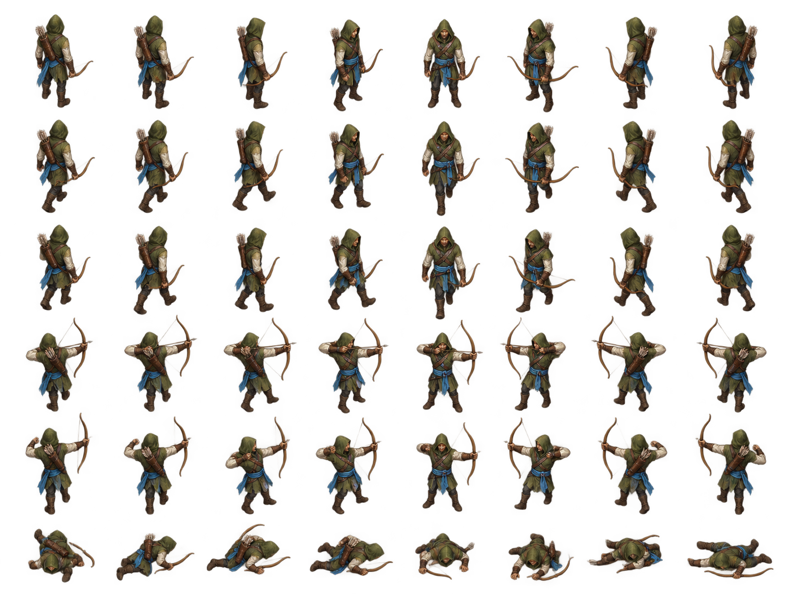

# Archer sprite exploration v1

Painterly Archer cutout exploration for the fixed oblique RTS camera. The atlas remains source art; a canonical runtime-candidate manifest, a visibility-preserving runtime page, and a derived team-accent mask are packaged beside it.



The transparent sheet has eight approximate facing columns and six rows: idle, two walk poses, bow draw, arrow release, and a defeated pose. Open the shared [animation test](../sprite-animation-test.html) to see the walk and attack sequence. Run the source-pack check with:

```sh
node scripts/validate-unit-sprite-atlas.mjs assets/units/archer-sprite-v1/manifest.json
```

See [`manifest.json`](manifest.json), [`PROMPT.md`](PROMPT.md), and [`PROVENANCE.md`](PROVENANCE.md) for frame metadata and source details.

The renderer-facing manifest is [`sprite-atlas-pack-v1.json`](sprite-atlas-pack-v1.json). It records full-cell fallback cutouts, explicit actor crops, estimated stable ground pivots, eight-direction clips, separate visual bounds, and an aligned team mask. The zero-gutter pilot declares linear filtering, no mipmaps, and the same half-texel inset for color and mask. `archer-atlas-runtime.png` changes only RGB beneath fully transparent pixels; visible source pixels and alpha are unchanged.

The manifest records 48 frame rectangles, pose bounds, bottom-center ground pivots, eight-direction idle/walk/attack/defeat sequences, and world bounds. `team-accent-mask.png` is a derived gray8 mask: black preserves the source and white applies the team hue while preserving luminance and alpha. The source atlas is unchanged.

The Archer silhouette uses a moss hood, bow, quiver, and Azure sash. Its attack state is two still poses without an authored arrow; the preview supplies a simple illustrative projectile. Hit and spawn states and live renderer integration are not included.
