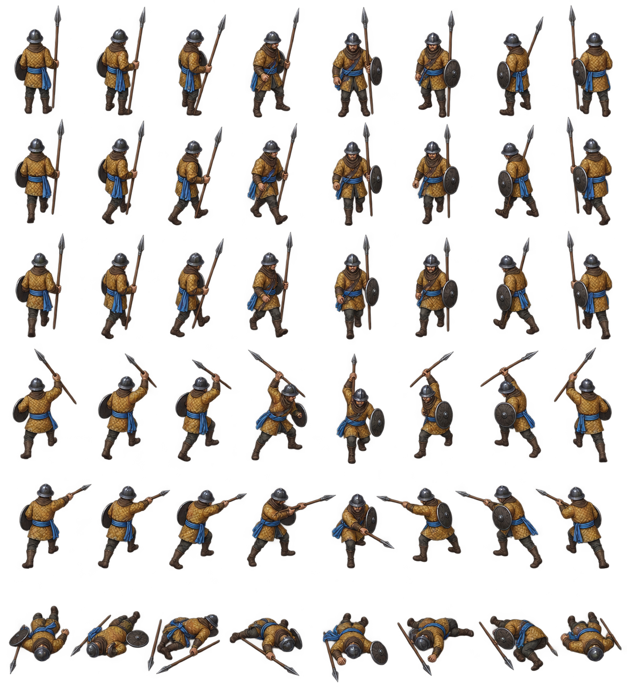

# Infantry sprite exploration v1

This sheet explores a painterly cutout Infantry for the fixed oblique RTS camera. The atlas remains source art; the live unit renderer has not been changed.



The atlas has eight approximate facing columns and six rows. See [`manifest.json`](manifest.json) for the intended order, row definitions, pixel-edge partition, hash, and current limitations. Open [`preview.html`](preview.html) to inspect individual frames, and the shared [animation test](../sprite-animation-test.html) to see the three roles move. Check the source pack with:

```sh
node scripts/validate-unit-sprite-atlas.mjs assets/units/infantry-sprite-v1/manifest.json
```

| Row | Pose |
| --- | --- |
| 0 | Idle, ready stance |
| 1–2 | Two walk poses |
| 3–4 | Attack wind-up and strike |
| 5 | Defeated corpse |

## What this sample establishes

- The painterly cutout style can sit beside the existing painted environment assets without requiring a Blender-authored runtime model.
- An eight-view atlas can express facing changes for the locked battlefield camera.
- The pack can follow the building-art workflow's source image, manifest, provenance, and browser-preview conventions.
- The manifest records frame rectangles, pose alpha bounds, bottom-center ground pivots, per-facing idle/walk/attack/defeat sequences, and separate footprint/art/culling/selection bounds.
- A derived gray8 `team-accent-mask.png` marks the sash. Black preserves source RGB; white applies full team hue while preserving source luminance and alpha.

## What is still unresolved

- The ImageGen prompt asked for seven rows but produced six; directions and cell edges are only approximate and need cleanup.
- Walking has only two frames, so the loop will look rough. Gathering, building, hit, spawn, and fuller attack/defeat sequences are absent.
- There is only an Azure-blue sash in the source. The aligned mask supports runtime team recoloring, but the treatment has not been visually reviewed in-game.
- Eight facings are approximate; animation still has a two-frame walk and two attack poses. Pixel art cleanup and ordinary-zoom readability have not been approved.
- The metadata and masks are not yet loaded by the game.

Do not count this sheet as runtime appearance or performance evidence. The next slice is an integrated small roster at ordinary game zoom, followed by corrections to the most visible facing, pivot, scale, and team-color errors.
