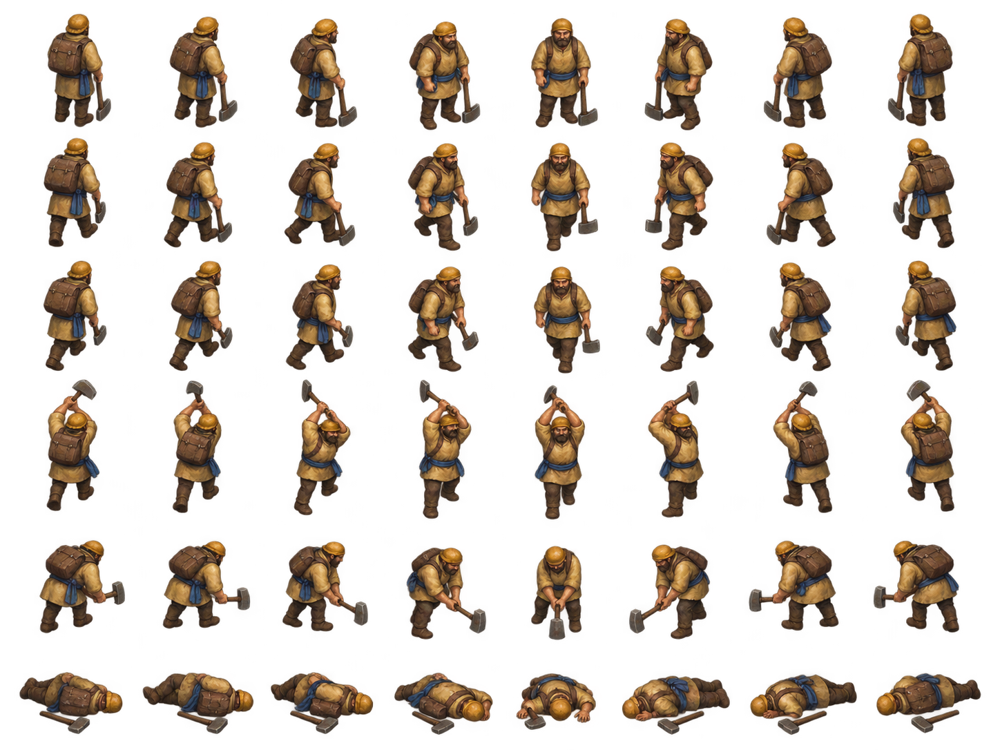

# Worker sprite exploration v1

Painterly Worker cutout exploration for the fixed oblique RTS camera. The atlas remains source art; a canonical runtime-candidate manifest, a visibility-preserving runtime page, and a derived team-accent mask are packaged beside it.



The transparent sheet has eight approximate facing columns and six rows: idle, two walk poses, a gather chop, a build strike, and a defeated pose. Open the shared [animation test](../sprite-animation-test.html) to see it in a moving scene. Run the source-pack check with:

```sh
node scripts/validate-unit-sprite-atlas.mjs assets/units/worker-sprite-v1/manifest.json
```

See [`manifest.json`](manifest.json), [`PROMPT.md`](PROMPT.md), and [`PROVENANCE.md`](PROVENANCE.md) for frame metadata and source details.

[`sprite-atlas-pack-v1.json`](sprite-atlas-pack-v1.json) is the renderer-facing manifest; `manifest.json` keeps the source-sheet row analysis used by its deterministic adapter. The canonical pack records 48 logical frames, full-cell fallback cutouts, explicit actor crops, cell-local pivots, eight-direction idle/walk/gather/build/defeat clips, and separate visual bounds. The zero-gutter page declares linear filtering, no mipmaps, and a shared half-texel inset for color and mask sampling. `worker-atlas-runtime.png` copies the source page while bleeding nearest edge RGB into fully transparent pixels within each cell; visible RGBA pixels and alpha are unchanged. `team-accent-mask.png` is gray8: black preserves source RGB and white applies full team hue while retaining source luminance and alpha.

The Worker silhouette uses the unit kit's warm cap, backpack, broad tool, and Azure sash. The runtime tint mask covers the sash and a torso-limited warm linen panel so the opposing team reads more clearly. Gather and build remain single action poses, not timed action loops. There is no food-carry state or combat attack pose.

The local game has an opt-in Worker sprite pilot: add `?workerSpritePreview=1` to the game URL. The all-role preview uses `?unitSpritePreview=1` to load Worker, Infantry, and Archer packs together; the ordinary game path remains unchanged. A current all-role game capture confirms the packs render at play and strategic zoom, but is static and shows small unit silhouettes on the wide review map. Live game orders map walking, role actions, facing, and defeat to atlas clips; the transitions still need a live-action capture.
