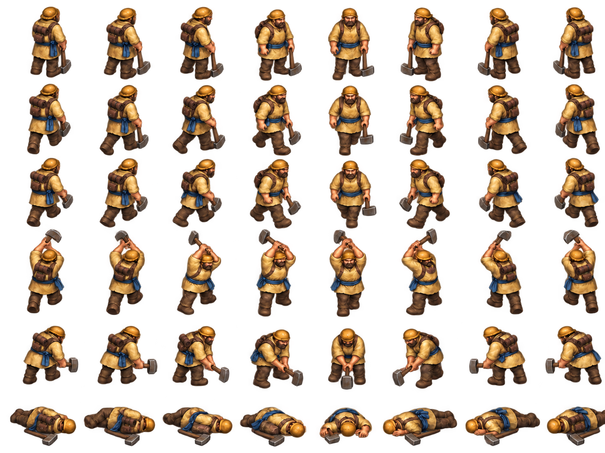

# Worker sprite exploration v2

Painterly Worker atlas revision focused on a clearer human silhouette at RTS game zoom. Compared with v1, this pass reduces the pack and gives the shoulders, arms, torso, and legs more visual weight. The atlas is a source-art candidate; its frame metadata, mask, runtime page, and canonical pack are deterministic derivatives.

The sheet uses eight approximate facings and six aligned rows: idle, two walk poses, a gather chop, a build strike, and a defeated pose. The standing poses share the existing foot-pivot heuristic. This pass has visible red/yellow edge contamination around the cutouts. It is now available in the opt-in game renderer with `?workerSpritePreview=1`, so its scale and silhouette can be judged in gameplay context while the sheet remains an experiment. The pack still declares `runtimeReady: false`: repair the alpha edge and review its estimated pivots before considering a default renderer switch.

The sealed [`renderer-worker-sprite-v2` game capture](../../../assets/generated/.game-dev/runs/run_1790456946229_b94e30f44ff44156a72e644f09b49a02/capture.json) covers both teams, Meadow/Cinder, and play/strategic zoom. At play zoom the cutout halo remains visible; at strategic zoom the team/role markers read more clearly than the character. The capture is static and does not yet exercise live action transitions.

Validate and regenerate the derived files with:

    node scripts/prepare-unit-sprite-atlas.mjs assets/units/worker-sprite-v2/manifest.json
    node scripts/validate-unit-sprite-atlas.mjs assets/units/worker-sprite-v2/manifest.json

See PROMPT.md, PROVENANCE.md, manifest.json, and sprite-atlas-pack-v1.json. The three-role `?unitSpritePreview=1` comparison continues to use Worker v1 so the newer Worker pass can be judged independently.
