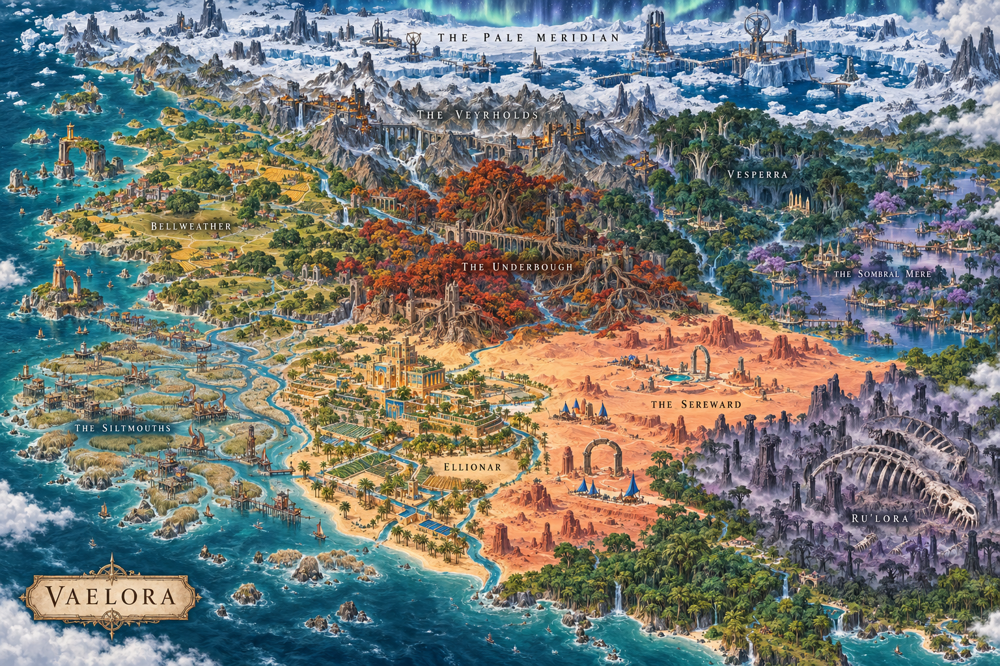

# Art direction and shared conventions

[Documentation index](README.md) · [Asset guide](assets.md)

## Visual target

Create the painterly world of **Vaelora**: welcoming everyday craft beside ancient, sometimes dangerous power. Distinct regional palettes, plant silhouettes, terrain materials and cultural architecture establish identity at a glance. Broad value shapes must survive game zoom; fine noise cannot compensate for an unreadable role or building.

The [selected world atlas, ten zone maps and ten ecology keys](art-direction/vaelora-v1/README.md) are the current aspirational art checkpoint. They supersede the earlier generic frontier illustration as the active visual target. They are concept references, not runtime evidence or exact scale specifications.

Azure and Ember remain match identities. Region and culture palettes must remain recognizable under either owner's team accents. Environment cutouts, unit geometry and captured building views must share scale, lighting and readable silhouettes within each region.

The blueprint-derived peoples and faction explorations propose character anatomy, clothing, materials and architecture for the four working allegiances. They extend the world checkpoint as source concepts; ancestry is not restricted by allegiance, and their role labels add no gameplay abilities.

The [first-civilization architecture kit](frontier-civilization-art-style.md) develops a Bellweather-inspired Frontier building family, with [eight illustrated Complete concepts](lore/frontier-architecture.md) for wiki and production use. These are source concepts; runtime views and lifecycle integration proceed separately.

## Visual development backing

Every new or changed player-facing visual outcome must be backed by linked art,
storyboards or explorations. This includes assets, procedural geometry/shaders,
map composition, animation, combat/command cues, menus and HUD. Sound and story
work should link their cue/story explorations and relevant world sources too.
Use the [4 October gap inventory](art-direction-gaps-2026-10-04.md) to find
existing backing and unanswered questions; implementation status remains in
the owning guide and [adoption checklist](asset-adoption-checklist.md).

Before producing or changing the presentation, record in its existing task,
guide or PR:

- **Intent and backing:** what the player should recognize or feel, its region,
  culture/role where relevant, and the exact source board, study or exploration.
  Link actual inspectable artwork or an accessible preserved artifact; prose,
  file receipts and tests alone are not visual evidence.
- **Selected treatment:** what is reused or changed, why it fits, and whether
  the direction is selected, exploratory, rejected or a temporary placeholder.
  Keep original sources and meaningful alternatives with selection reasons.
- **Time and state:** for motion or transitions, a small storyboard or annotated
  sequence showing trigger, key poses/states, contact/root, timing and loop/end.
  UI flows can use annotated wireframes; materials can use paired visual studies.
- **Game-scale target and delivery:** camera/scale, normal and strategic zoom,
  both-team readability and relevant fog/accessibility constraints; consuming
  runtime, retained owner and intended in-game check.

Scale the backing to the change. A small correction can cite existing approved
art and an annotated defect comparison; a new family needs identity/silhouette
exploration, and a new transition needs its sequence. Reusing relevant sources
does not require new generation or redesign. Rough storyboards and short usable
sequences are sufficient to support incremental work; breadth before polish
remains the animation priority. A private source stays within its existing access
and publication scope, with availability recorded honestly.

A board establishes design intent; actual ordinary-game evidence establishes
appearance. Keep those claims separate. This adds a production input requirement,
not a manager approval queue or a full-matrix merge gate. Pure internal refactors
with no presentation change can record backing as not applicable.

## Camera, scale, and team identity

| Convention | Rule |
| --- | --- |
| World scale | One world unit per map cell; Y up, +Z forward, grounded origins. |
| Review zoom | Ordinary 0.91 and strategic 0.48; 2.3 is optional close inspection. |
| Review viewport | 1280 × 720 CSS pixels; record DPR and actual output dimensions. |
| Unit scale | About 0.8 world units tall; improve role LOD rather than silently changing world scale. |
| Gameplay footprint | Barracks/Range occupy 3 × 3 cells; Town Centers use the server-owned four-cell-wide base footprint. Visible art bounds are separate. |
| World hues | Azure `#5AA7D7`, Ember `#E67A5E`; brighter UI colors stay in overlays. |
| Authored unit accent | Shared sash; equipment remains neutral. |
| Authored building accent | Small owner-selected standard; architecture and trim remain neutral. |
| Shape identity | Azure straight-cut pennant with centered bar and square marker; Ember forked tail/split mark and diamond marker. |

Worker: pack and broad tool. Infantry: spear and six-sided shield. Archer: bow
and quiver. Town Center: wide hall and rear tower. Barracks: enclosed gable and
gate. Archery Range: open canopy and target. Test these cues at native display size.

The user-approved Human appearance preview on 30 September 2026 retains the existing Human atlas height of **1.2161865234375 world units**. This is the production baseline for the current Human roster, superseding the approximate 0.8-unit guidance for these sprites. Preserve that apparent body height across equipment and actions; long weapons must not shrink the body when atlas alpha height grows. See [Human roster production](art-direction/human-roster-v1/README.md).

## Rules by asset family

- **Ground:** seamless opaque paint, quiet contrast, world-aligned repetition,
  connected brush edges. Terrain material does not set collision.
- **Environment cutouts:** transparent source/runtime pairs, consistent family
  canvas/pivot/world size, no baked team tint, rings, UI, or background.
- **Units:** rigid named parts, shared batch keys, neutral role equipment, and
  renderer-driven states. The textureless GLB v1 contract and painted-atlas
  experiments have different compatibility requirements.
- **Buildings:** preserve anchor and apparent scale across states/views. Selection,
  health, rally, and production cues stay renderer-owned.
- **Animation:** separate movement, task, attack events, damage, spawn, and defeat.
  Consume only fog-filtered state; defeat ends that generation's pose.
- **HUD:** preserve text labels and accessible names with icons. Native cursors
  follow the [current manifest](ui-cursor-icon-contract.md), including hotspots
  and keyword fallbacks.

Water should remain muted blue-green with restrained sand/shore transitions.
Reserve vivid team, interaction, and warning colors for their gameplay meaning.

## Implementation boundaries

The [asset guide](assets.md#know-what-is-actually-in-game) names current loaders
and candidates. Town Centers use captured directional views; Barracks and Ranges
use direct sprites. Their loaders retain procedural fallbacks. Authored unit GLBs
remain candidates; source previews do not prove runtime batching or readability.

Use manifests for exact dimensions and hashes. Follow the
[renderer contract](renderer-state-contract.md) for v1 GLBs/environment states,
[building pipeline](building-asset-production-pipeline.md) for captured models,
and [sprite-atlas contract](sprite-atlas-contract-v1.md) for pages and layers.

## Evidence for an appearance claim

1. Identify the code revision, asset manifest, loaded file hashes, map, team,
   viewport, DPR, zoom, and represented state.
2. Capture actual gameplay at normal and strategic zoom with appropriate visibility.
3. Inspect the pixels for role/team recognition, ground contact, silhouette,
   alpha edges, depth, and state differences.
4. State missing roles, directions, teams, materials, or states explicitly.

The unit-role matrix has eight views: two grounds × two viewing teams × two
zooms, with all three roles visible for both teams. The full environment matrix
has forty image-bearing state/theme/zoom frames plus a clear-ground assertion.
A smaller named pilot can support a smaller change.

A source sample can ship with documented limits. Full M2 visual evidence and M3
2,000-unit measurements support milestone claims; they are not routine approval
queues. Ordinary appearance captures need a working GPU/browser, not a numeric
quiet-host threshold. Performance comparisons need controlled conditions.

## Historical review

The [previous art-direction record](archive/2026-09/art-direction-contract-v1.md)
retains source-review findings, old branch/PR references, and unreviewed candidates.
The [environment pilot](qa-evidence/environment-state-pack-v1/pilot/README.md)
provides later runtime evidence for a four-frame subset. A source-only edge
cleanup or material candidate becomes runtime art only through an explicit
pack/loader update with matching hashes.
