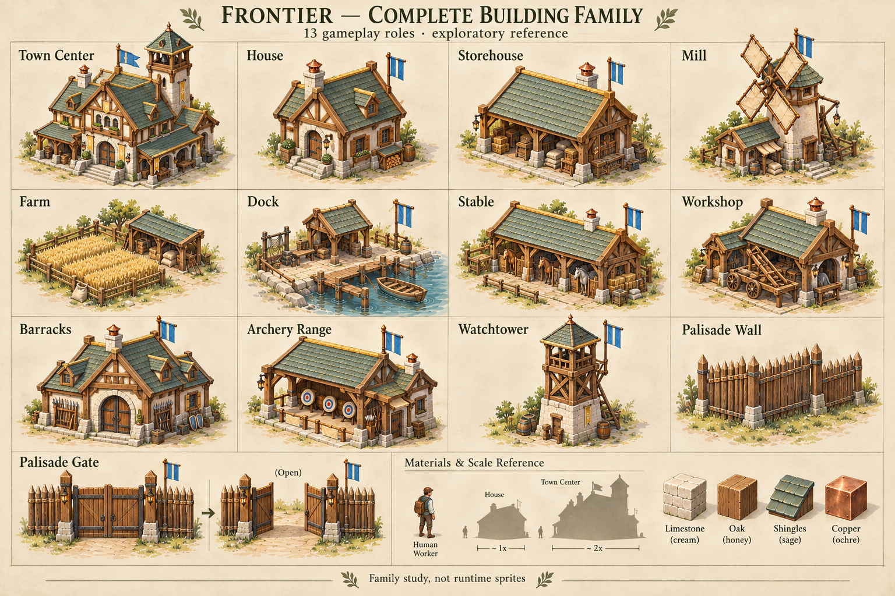
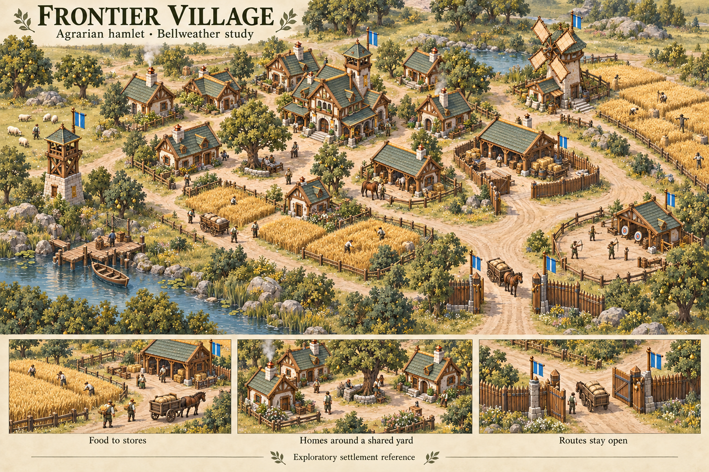
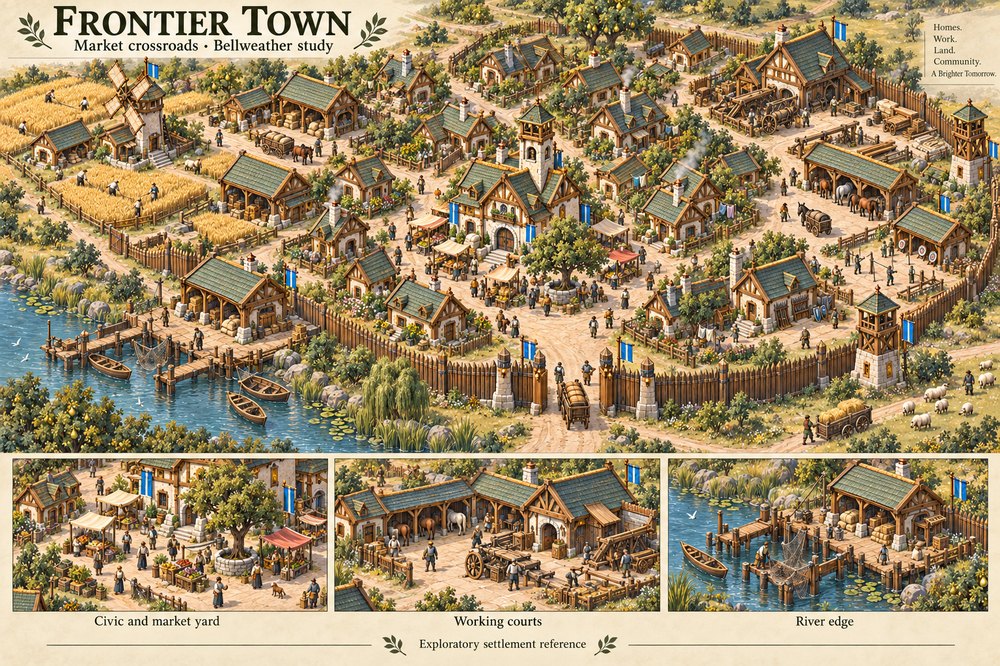
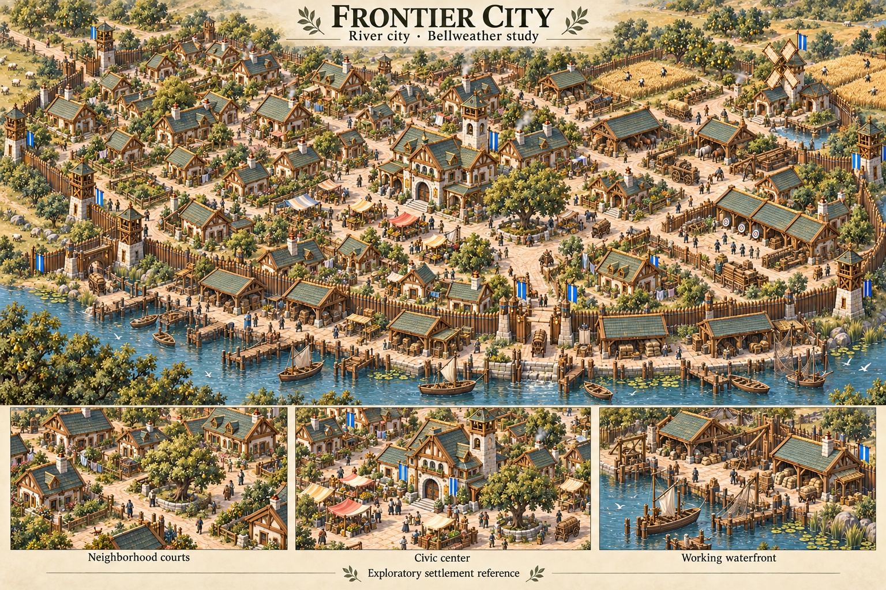
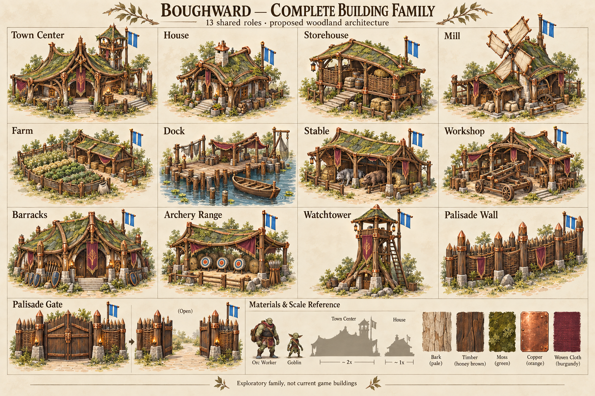
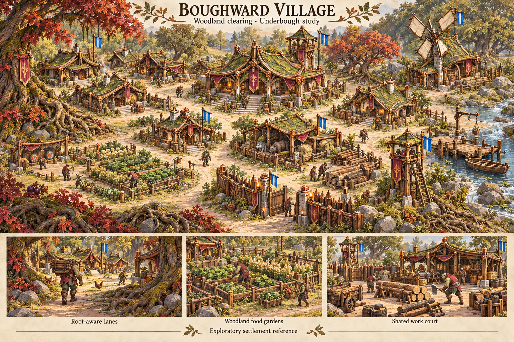
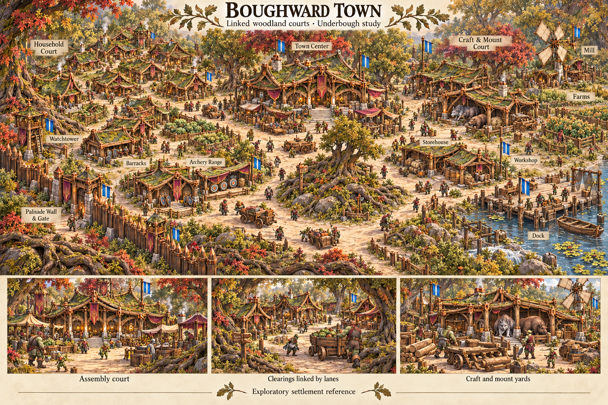
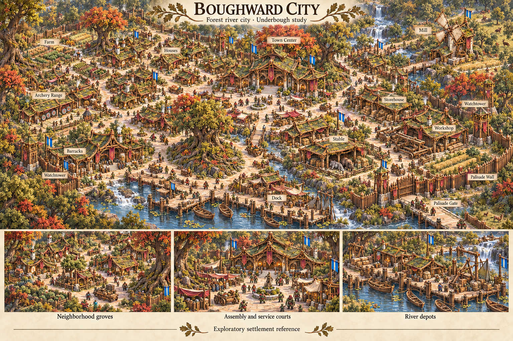

# Civilization buildings and settlements — v1

[Art direction](../../art-direction-contract-v1.md) · [Frontier style](../../frontier-civilization-art-style.md) · [Boughward source direction](../boughward-roster-v1/README.md) · [Art evolution](../../lore/art-evolution.md)

User-requested visual reference library, 4 October 2026: **eight exploratory
boards**, four each for Frontier/Human and Boughward. Each family sheet depicts
all thirteen current shared building roles; village, town and city studies
explore how the same craft vocabulary supports different settlement density,
terrain, work and public spaces. Each settlement board includes three detail
insets. These are source studies, not runtime sprites or captured matches.

All boards remain **exploratory and unselected**. The user's agreement established
the need for a reference library, not acceptance of every generated building,
layout, flag, scale or detail. The word Complete in the family-sheet title means
role inventory, not production lifecycle completeness.

## Browse the set

| Study | Frontier/Human | Boughward | What to compare |
| --- | --- | --- | --- |
| Full building family | [13-role sheet](frontier-building-family-v1.png) | [13-role sheet](boughward-building-family-v1.png) | Shared materials and craft, distinct work silhouettes, civic/domestic hierarchy, gates and walls. |
| Village | [Agrarian hamlet](frontier-village-v1.png) | [Woodland clearing](boughward-village-v1.png) | Sparse households, shared yards, food/store access and the landscape around settlement. |
| Town | [Market crossroads](frontier-town-v1.png) | [Linked woodland courts](boughward-town-v1.png) | Neighborhood organization, work/mount courts, defensive access and shoreline services. |
| City | [River city](frontier-city-v1.png) | [Forest river city](boughward-city-v1.png) | Denser repetition, larger public/service spaces, connected districts and waterfront. |

The thirteen roles are Town Center, House, Storehouse, Mill, Farm, Dock, Stable,
Workshop, Barracks, Archery Range, Watchtower, Palisade Wall and Palisade Gate.
They match [current building definitions](../../../src/gameplay-definitions.mjs)
at source `5d081ecf376f2e6e19331713bb5cc764bae75941`. Both current presentation
appearances use those same rules. Boughward has no separate default building
family in the game; its entire architecture set here is proposed visual work.
Frontier's original eight selected Complete concepts retain their own identities
and production records. These new sheets do not overwrite those sources or
select the earlier Mill/Farm/Dock A/B proposals.

## Frontier/Human

Warm cultivated craft: cream limewash and river limestone, honey oak, sage
shingles, modest ochre and copper. Buildings express work through entrances,
roof massing and courts. Village-to-city development tests more connected
streets, household clusters, civic gathering and working waterfronts.

## Boughward

Woodland craft: curved/braced timber, pale bark, copper joints, moss roofs and
burgundy cloth. Ground-level settlements retain tree/root islands and link
working clearings. The family starts from the preserved Boughward board rather
than treating this appearance as a recolored Frontier kit. Orc/Goblin people and
wolf/boar mounts reference the actual roster; the earlier wider concept cast
does not become additional gameplay units.

## Source review and production limits

All eight outputs were visually inspected as generated source art. Both family
sheets visibly cover the thirteen named roles, with distinct food, production,
military and barrier silhouettes. The settlement studies preserve their family
materials, foreground ordinary work and include local detail scenes. Frontier's
street/court pattern contrasts with Boughward's retained grove/root islands.

The following remain useful revision questions rather than accepted specifications:

- **Registration and scale:** concept perspective, small people, visible bases,
  doorway sizes and lower scale strips are illustrative. They are not measured
  cameras, pivots, occupancy or clearance. Source prompts' household count targets
  do not establish exact population, map capacity or counted buildings in the art.
- **Readability and density:** the city studies are denser, but are still low-rise
  town-like compositions; larger urban variety remains an exploration. Broad
  paths are visible, while ground/foliage/detail often remains too busy for
  strategic gameplay. Insets are newly drawn details, not pixel crops of one
  registered scene. Actual fog/occlusion and game-zoom acceptance remain open.
- **Architecture continuity:** Frontier support silhouettes and both families'
  relative proportions need comparison with preserved models/captures. Boughward
  inherits some cream masonry/chimney motifs and can explore greater structural
  variety while keeping readable work frontage. Root forms imply no magical
  growth, tree-only placement or new navigation rules.
- **Team and cultural marks:** Azure examples mostly use blue/bar pennants;
  folds, ornaments and incidental crests still require the actual shape contract.
  Burgundy Boughward cloth is cultural, not Ember ownership. Both owner colors
  and shape marks must be reviewed before runtime production. Generated grain/tree
  crests and extra mottos establish no canonical symbols or branding.
- **Scope of drawn details:** market stalls, wells, carts, gardens, household
  variants, steps, piers and city-scale planning are environment/world studies,
  not new building definitions, prices, tier progression or simulation abilities.
  Frontier city includes sailboats despite the requested unarmed Skiff scope;
  retain them as unselected composition details, not a fleet direction. Mill
  remains food-only drop-off, Farm finite food and Dock the current Skiff/food
  return boundary. Large-looking gates do not expand one-cell gameplay occupancy.

## Use and ownership

The [Frontier economy model slice](../frontier-economy-meshy-v1/README.md) selects
only this sheet's Mill/Farm/Dock silhouettes and materials for user-authorized
candidate model production, with isolated references and exact prompts. It
does not select the entire family/settlement boards or replace existing models.

Art direction retains the source library. Building architecture can select a
bounded silhouette or lifecycle input, and Maps/Environment can select a scene
composition for their existing outcomes. Record the exact board, selected aspect,
reason and changes in that task before production; preserve later alternatives
under new versioned filenames. A scene can inform a layout without making every
drawn object interactive. [Art lanes](../../art-production-lanes.md) and the
[adoption checklist](../../asset-adoption-checklist.md) retain downstream ownership.

These studies back a discussion of the two current appearances; other Vaelora
regional/cultural settlement families remain future scoped explorations. They
do not establish that all humans share Frontier craft, that Boughward controls
the entire Underbough or that game maps have a fixed canonical location. Village,
town and city are settlement composition studies, not implemented advancement
tiers or selected settlements from the [working lore](../../lore/settlements.md).

## Provenance and validation

[prompts.json](prompts.json) preserves all eight exact executed prompts and
reference-input roles. [manifest.json](manifest.json) records original built-in
ImageGen filenames, PNG dimensions/bytes/hashes, exact input hashes, role coverage
and source baseline. Every image is an unmodified 1536 × 1024 output copied from
its original tool destination. Later boards explicitly reference earlier
exploratory boards as well as selected ecology; this chain is retained, not
flattened into a claim that every source is approved. No third-party or private
image inputs were used, and no earlier asset was overwritten.

Source-milestone validation: all eight original copies and PNG headers/dimensions,
output/reference hashes, thirteen-role registry parity, visual review and
documentation links. The eight PNGs total 30,590,996 bytes. These are reference
sources outside runtime admission/release packaging. No state packs, loader,
server, gameplay, deployment or ordinary-game appearance changed in this slice.
