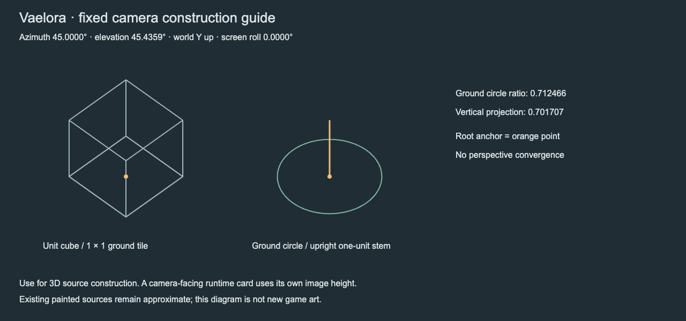
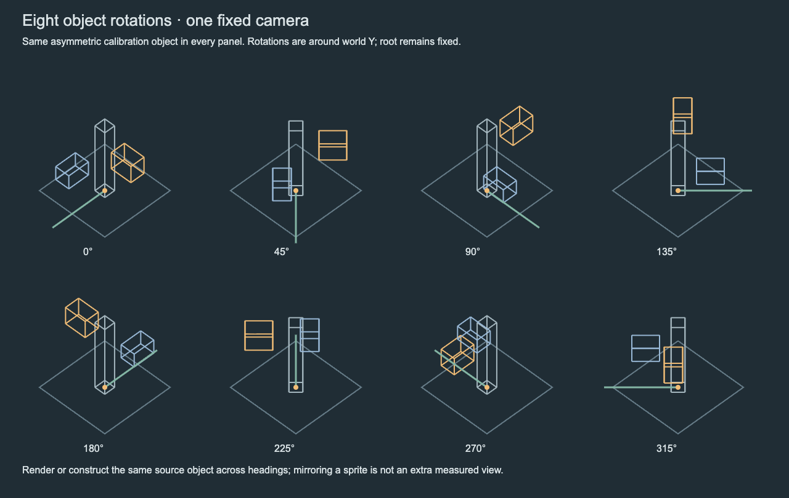
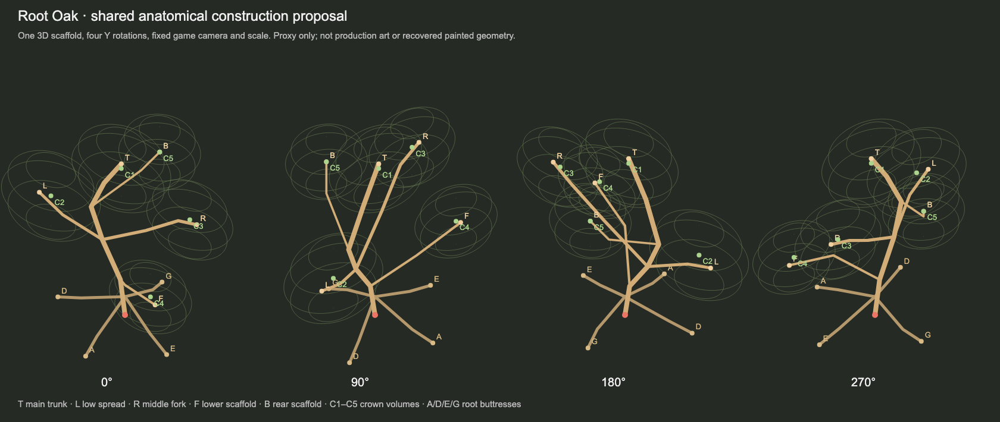

# Environment camera construction reference

This production guide is generated from [the runtime camera vector](../../../src/camera-controls.mjs), using Three.js orthographic projection. It supplies measured construction references for later environment sprites and directional source sheets. Current painted assets remain approximate fixed-view samples.

The camera is at 45° azimuth and 45.4359024848° elevation above ground, with world Y up and effectively zero screen roll. A horizontal circle projects to an ellipse with a 0.7124658869 minor/major ratio. A physical one-unit vertical projects to 0.7017067479 screen units. These values describe source-object projection; a runtime camera-facing sprite card uses its registered image width/height directly.

All eight panels use the same asymmetric calibration object, camera and bottom-center root. Headings rotate the object around world Y in 45° steps, with zero heading pointing along positive Z. The colored offset boxes reveal orientation changes. This is a construction reference, not a production plant sheet or evidence that existing specimens have eight registered views. For a later asset, preserve the same source object, canvas, root and scale through each heading and its harvest states.

Editable [camera SVG](camera-construction.svg), [heading SVG](heading-registration.svg) and [numeric measurements](measurements.json) accompany the PNG previews. Regenerate SVG/JSON with `node scripts/build-environment-camera-guide.mjs`; PNGs are Chrome raster previews of those SVGs. No ImageGen or private reference was used. The builder follows future camera-vector changes; rerender previews when regenerating it.

Validation on 30 September 2026: camera-vector equality, eight headings, effectively zero roll and measured vertical projection pass; both rendered previews visually inspected. Chrome emitted macOS display-link diagnostics but wrote both complete images; the two isolated capture processes were stopped afterward. No runtime or gameplay change, performance claim or source-perspective certification.

## Root Oak shared construction proposal — 1 October 2026

The rejected independent directional drawings motivate a common anatomical
reference. The [editable construction](root-oak-construction.json) defines a
twisted main trunk, four attached scaffold branches, five ellipsoidal crown
volumes and four named root buttresses. The [projected SVG](root-oak-construction.svg)
shows the same points and volumes at 0/90/180/270 degrees, fixed camera and scale.
Labels preserve branch/crown identity through rotations. The red point is the
shared root origin.

This is a manually proposed proxy, not a reconstruction or certification of
the existing painted Root Oak. Its branch thicknesses and simplified volumes
are drawing guides, not production meshes or new runtime tree art. An artist
must reconcile the proposal with the original silhouette before painting from it.
No extra accepted regional views or harvest states are claimed.

Regenerate with `node scripts/build-root-oak-construction.mjs`. The builder checks
that scaffold attachments reference existing main-trunk points, every crown has
a known branch, and opposite views preserve horizontal extent. The
[projection record](root-oak-construction-projections.json) retains root origins,
attachment coordinates and bounds. Chrome PNG previews were visually inspected;
the first process wrote its image but exceeded its 40-second exit deadline and
was terminated. The adjusted preview stops its own browser after file creation.
These checks establish consistency of the proxy, not identity with painted art.
