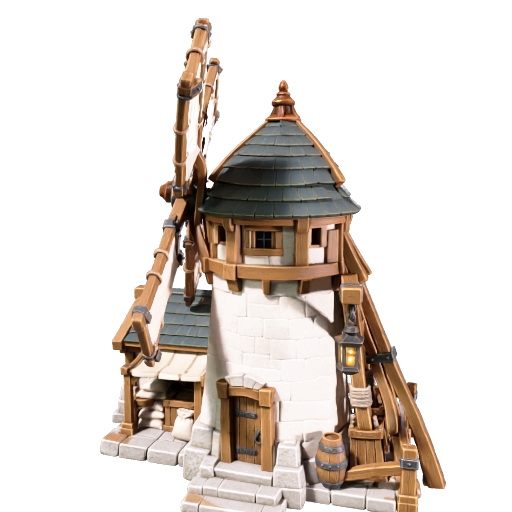
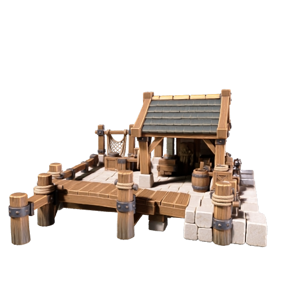
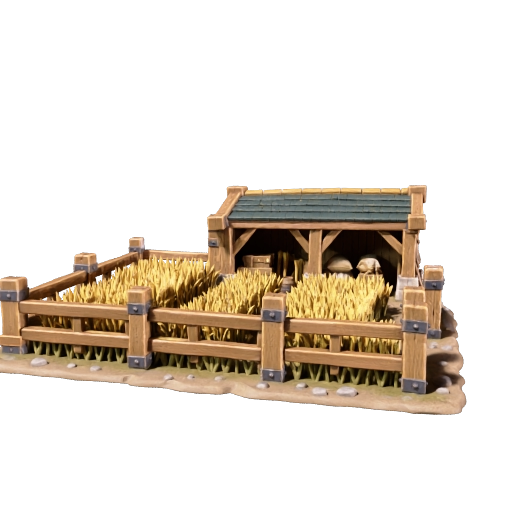

# Frontier economy models — Meshy v1

[Frontier direction](../../frontier-civilization-art-style.md) · [Building production](../../building-atlas-production-plan.md) · [Adoption checklist](../../asset-adoption-checklist.md) · [Reference family](../civilization-settlements-v1/README.md)

On 4 October 2026 the user requested identification of missing civilization
models and submission to Meshy. This source slice covers the **Frontier/Human
thirteen-building roster** at `5d081ecf376f2e6e19331713bb5cc764bae75941`.
It does not replace eight existing building identities or start a Boughward
production batch. Units, wildlife and scene props retain their separate outcomes.

## Inventory and generation scope

| Roles | Existing model evidence | Action |
| --- | --- | --- |
| Town Center, House | Scale-pilot provenance records two successful Meshy tasks. | Recover/reuse originals; no duplicate generation. |
| Storehouse, Stable, Workshop, Watchtower | Civilization-models provenance records four produced source models. | Recover/reuse originals; no duplicate generation. |
| Barracks, Archery Range | Local military authoring scripts, provenance and sixteen Complete captures. | Reuse authored sources; no Meshy replacement. |
| Palisade Wall, Palisade Gate | Coastal owner's latest chat records a private authored wall/gate export packet. Public selector still uses procedural art. | Existing source/adoption work, not missing base-model generation. |
| Mill, Farm, Dock | No authored source/default family found in tracked packs or inspected retained records. | Three new textured image-to-3D tasks below. |

Read-only Coastal evidence: chat **Design coastal and barrier assets**,
`01a101c3-0d65-730a-9cd1-4a2cca605039`, most recent owner checkpoint inspected
on 4 October. It reports private packet `libfile_77bf4c8e9ba081918be1fa86071ea57c`
and delivery report `libfile_c848e2736d088191ab91ada851f56221`.
Those pixels/models were not imported or visually reviewed here. The
[Coastal workstream](../../coastal-barrier-art-workstream.md) retains its scoped
publication and ordinary-game verification. Skiff also has a separately
authored private packet and is excluded from new generation.

## Selected production inputs

The exploratory [Frontier thirteen-role sheet](../civilization-settlements-v1/frontier-building-family-v1.png)
provides the bounded Mill, Farm and Dock silhouettes for this user-authorized
source production. Only those roles/materials are selected as generation inputs;
this is not approval of every board detail or final runtime appearance.
Built-in ImageGen derived the isolated references below, with exact prompts in
[prompts.json](prompts.json). No earlier source was overwritten.

| Reference | Preserved identity and constraint |
| --- | --- |
| [Mill](mill-reference-v1.png) | Dry-land food-return grain mill, four stationary sails, cream tower, oak machinery and attached low porch; square 3 × 3 occupancy. No waterwheel or food-generation mechanic. |
| [Farm](farm-reference-v1.png) | Low fenced grain patch and modest corner shed; square 3 × 3 occupancy. This depicts the productive 200-food pool; exhausted appearance is a later authored state, with no automatic regrowth. |
| [Dock](dock-reference-v1.png) | Low shore work shelter, stone land apron and short timber landing; square 3 × 3 occupied land beside water. No boat/water baked into the building; Skiff remains separate. |

References were inspected before submission. Mill has a tall sail silhouette;
the Farm retains earth/stone detail and the Dock has a front landing overhang.
These require measured clearance and simplification during capture. Farm/Dock
include a soft background halo despite the requested transparent cutout; the
single-object subject remains isolated. PNG alpha alone is not registration or
proof of exact crop/footprint. No owner pennants or crests are baked into these
sources; existing team feedback must remain a separately measured treatment.

## Task trail and costs

Meshy CLI 0.4.0, production `api.meshy.ai`, reused verified session. One paid
submission per role, resource **image-to-3d**. Parameters: `standard` Meshy-7,
`ultra-mode=false`, `should-texture=true`, PBR enabled, 2k textures,
`remove-lighting=true`, target format GLB. These are offline render/authoring
sources, not a new direct GLB game consumer or a low-poly runtime claim.

| Model | Task ID | Local project folder under `meshy_output/` |
| --- | --- | --- |
| Mill | `01a107cb-427e-712c-b142-1d661883e5f7` | `20261004_124231_frontier-mill-v1_01a107cb` |
| Farm | `01a107cb-53fe-7134-b790-640f71952e1c` | `20261004_124233_frontier-farm-v1_01a107cb` |
| Dock | `01a107cb-60f7-7626-857a-570c93910152` | `20261004_124236_frontier-dock-v1_01a107cb` |

The free `meshy make <reference> --dry-run` planner reports 30 credits for
the textured image route: **90 estimated credits total**. Balance before
submission was 1,970. Actual charges and finished downloads will be recorded
in [provenance.json](provenance.json). No paid remesh, variant, texture rerun
or ultra pass is included. Local CLI task snapshots can contain expiring URLs
and remain under the existing ignored `meshy_output/` boundary; retained public
provenance contains hashes/IDs rather than credentials or signed URLs.

## Ownership and remaining acceptance

All three tasks succeeded. Their GLBs and thumbnails are downloaded, and each
rendered preview was inspected. Actual charges are **30 credits each, 90 total**;
the final balance is **1,880**. No additional paid stage or rerun was submitted.

The Mill render preserves the limestone tower, sage roof, oak machinery and
food porch; sails appear almost edge-on in the provider view, so frontal sail
shape remains unverified. Dock preserves its shore apron, work shelter and
mooring landing without a boat or water. All three are textured GLB 2.0 files with
embedded images and no external dependencies. [Mill inspection](mill-inspection.json)
and [Dock inspection](dock-inspection.json) count 2,206,392 and 1,767,254 triangles.
The [Farm inspection](farm-inspection.json) counts 7,848,278 triangles (about
246 MB), preserving individual grain detail in one mesh rather than supplying
separate editable crop patches. It will need careful simplification/segmentation
for productive/exhausted source states. Its preview preserves grain rows, low
fencing and the small shed, but crops the left fence corner; a registered
capture must include the complete silhouette.
These high-detail sources are suitable inputs for the existing sprite capture
workflow, not established real-time geometry budgets. The existing repository
measurement tool also records [Mill bounds](mill-measurement.json) and
[Dock bounds](dock-measurement.json) and [Farm bounds](farm-measurement.json);
their origin-centred provider coordinates
still need authored ground pivots and occupancy calibration. A thumbnail is
not an eight-view silhouette, back-face or gameplay appearance check.

Delivered files (ignored offline sources; GLBs are not shipped directly):

- Mill: `/Users/lb/.codex/worktrees/030a/thousand-unit-skirmish/meshy_output/20261004_124231_frontier-mill-v1_01a107cb/mill.glb`
- Farm: `/Users/lb/.codex/worktrees/030a/thousand-unit-skirmish/meshy_output/20261004_124233_frontier-farm-v1_01a107cb/farm.glb`
- Dock: `/Users/lb/.codex/worktrees/030a/thousand-unit-skirmish/meshy_output/20261004_124236_frontier-dock-v1_01a107cb/dock.glb`

Validation passed: thirteen-role registry/inventory parity, original/reference
PNG byte/hash equality, three accepted/completed task-ID receipts, each downloaded
GLB header/chunk/embedded-image check and file hash, provider receipt hash equality,
existing `inspect-building-glb.mjs` bounds/triangle measurement, preview inspection,
documentation links and whitespace. The initial measurement attempt lacked the
repository's `three` dependency; installing the pinned dependencies with
`npm ci --ignore-scripts --no-audit --no-fund` allowed the same tool to pass.
No runtime, release, deployment, graphics-capability or match test is claimed.

The art-direction owner in this chat (`01a107a5-8aa1-7fd0-81b1-997b4d563e89`)
owns this bounded reference/model delivery and retains the economy source
follow-up in the [adoption checklist](../../asset-adoption-checklist.md).
Source generation/download and rendered preview review are source milestones.
No default binding, release export, deployment or ordinary-game appearance is
claimed by this slice. Next: normalize model scale/pivot, inspect actual topology
and materials, derive registered eight-view captures and matching lifecycle
states, author Farm exhaustion, then integrate useful packs progressively with
both-team, fog, clearance and zoom checks at the identified served revision.

The existing eight Complete families still lack matched Foundation/Frame/Damaged/
Critical artwork (256 color views). That gap is state authoring from existing
models, not eight new Complete Meshy jobs. Private barrier/Skiff admission stays
with its existing owner. Village/town/city decorative objects remain reference
studies rather than an unbounded paid-model backlog.
