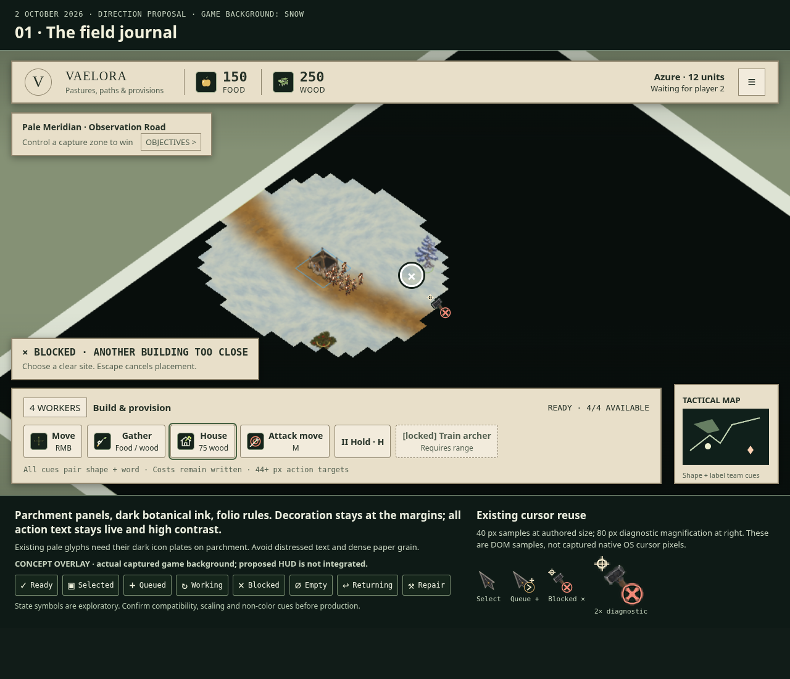
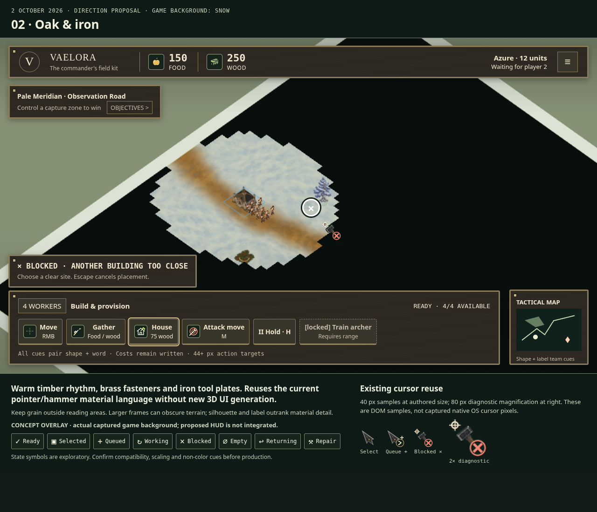
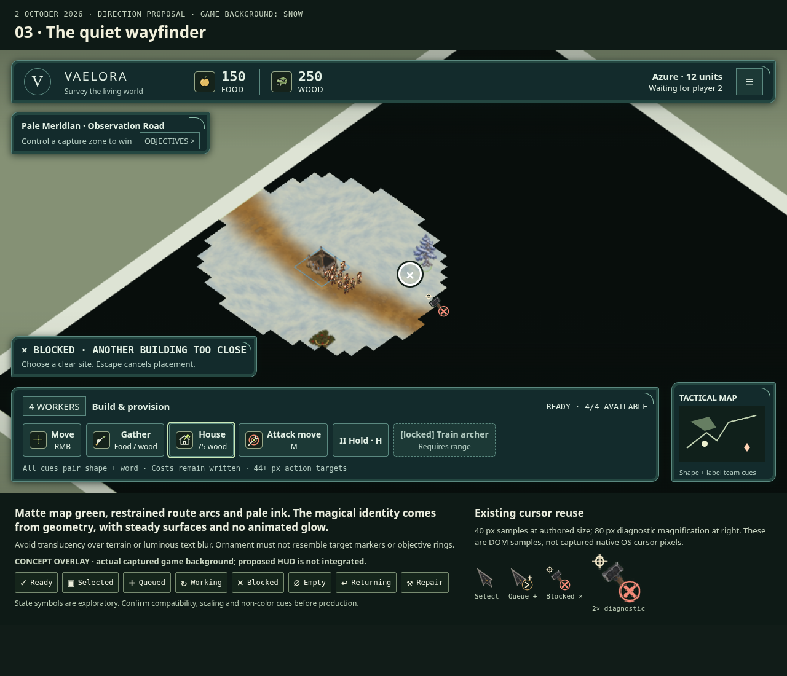

# Vaelora HUD direction study v1

**2 October 2026 — proposals for review.** Three code-authored 2D overlays use
existing cursor/icon files on actual captured game backgrounds. The proposed
HUD is not integrated. No ImageGen or new Meshy jobs were used for this pack.

## The field journal

Parchment, dark botanical ink and folio rules. Existing light SVGs sit on dark
plates. Reading surfaces stay plain; decoration stays at the margins.

## Oak and iron

Warm timber, brass fasteners and iron tool plates reuse the existing cursor
material language. Keep frames small enough to preserve terrain visibility.

## The quiet wayfinder

Matte map green and restrained route arcs. No moving glow or translucent text
surface; ornament must remain distinct from real gameplay markers.

## Review and reproduction

- [Compact three-concept preview](previews/compact-three-directions.png),
  with readable direction captions. Presentation thumbnails; use full-size
  images for text/badge evaluation.
- [Three-direction comparison](previews/three-directions-comparison.png).
- [All 16 cursors at 40 px; icons at 13/19/24 px](previews/asset-normal-size-check.png).
- Grayscale proxies: [journal](previews/journal-woodland-queued-grayscale.png),
  [wood](previews/wood-woodland-queued-grayscale.png),
  [map](previews/map-woodland-queued-grayscale.png). These are not calibrated
  color-vision simulations.
- [Audit and current binding/state table](../../vaelora-hud-icon-audit-2026-10-02.md).
- [Runtime text samples](contrast-runtime.json), [proposal text samples](contrast-proposals.json),
  [pixel review](review.json), [file inventory](manifest.json).
- [Initial sketches](iterations/initial/preview.html) and
  [original comparison](iterations/initial/previews/three-directions-comparison.png)
  retain unsupported Objectives/Hold glyphs and the original disabled-button
  treatment. The clipped first asset-board capture is also retained there.
- [Completed gameplay receipt](captures/attempt-2/live-capture.json),
  [failed first capture receipt](captures/attempt-1/failure.json), and
  [three terrain background receipts](captures/backgrounds/capture.json).

Open [preview.html](preview.html) through a local static server rooted at the
repository. Queries `?theme=journal|wood|map&terrain=snow|meadow|woodland&state=blocked|queued`
select a sketch; `?compare=1` displays all three. [asset-check.html](asset-check.html)
shows the current asset board. These HTML files resolve existing root assets;
they are not independent runtime applications or a hosted site.

[Executed source scripts](source/README.md) retain capture/render options and
the exact authoring code. The standard view is 1280 × 1100, DPR 1. At a
960 × 800 viewport this fixed 1280 px sketch overflows; responsive layout is
unfinished. Native OS cursor pixels are absent from direct screenshots, so the
cursor board uses DOM images. Values, objective prose and the schematic
mini-map are illustrative; photographed terrain/buildings/units are actual
gameplay. Full color-vision, human readability and real task-state acceptance
remain open.

This is a flat screen-space asset class: UI reference yaw is not applicable.
Image axes are screen right/down. No 3D orientation or eight-heading sprite
acceptance is inferred. Existing upstream asset provenance and rights are
retained; this pack makes no new claim about missing Mac-only work.

[Art evolution](../../lore/art-evolution.md) ·
[Cursor contract](../../ui-cursor-icon-contract.md) ·
[Documentation index](../../README.md)
