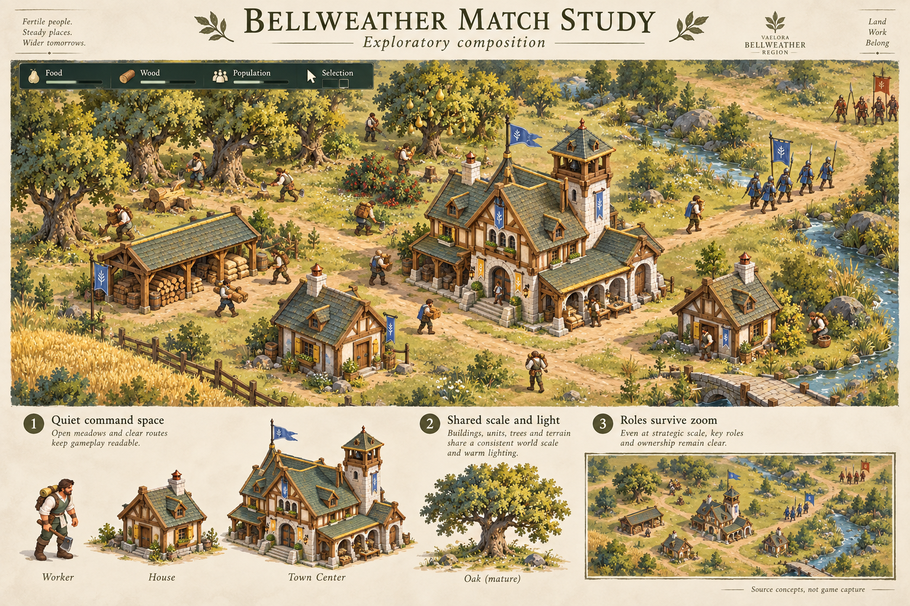
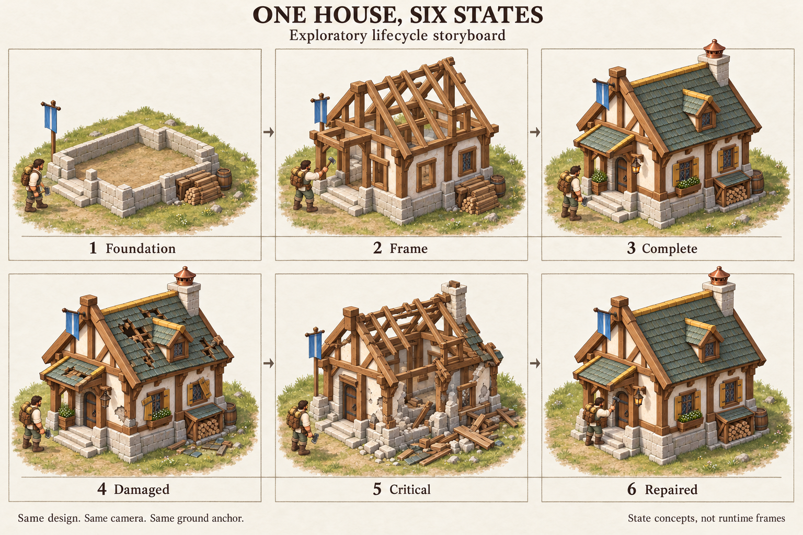
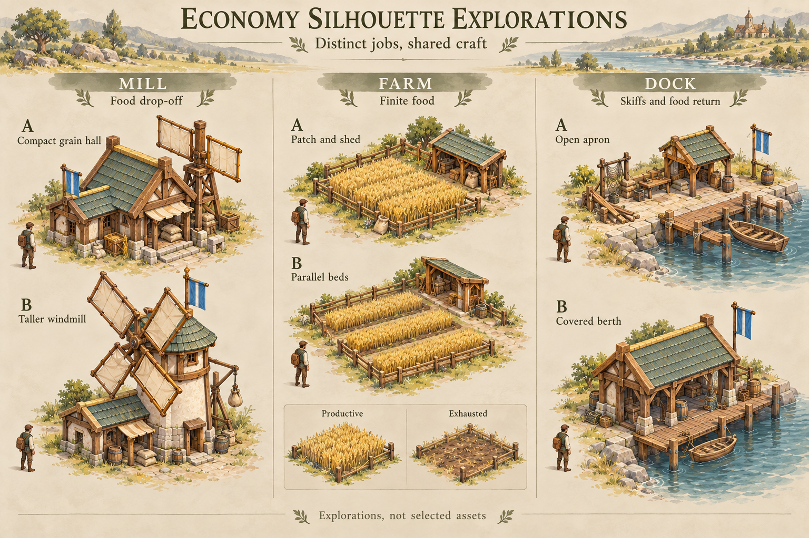

# Visual development examples — 4 October 2026

[Gap inventory](../../art-direction-gaps-2026-10-04.md) · [Art direction](../../art-direction-contract-v1.md#visual-development-backing) · [Preserved explorations](../../lore/art-evolution.md)

User-requested examples showing what composed-scene art, a storyboard and a
silhouette exploration contribute to production. All three are **exploratory,
unselected source studies**, generated with the built-in ImageGen tool from
existing public project references. They are not game captures, runtime exports,
measured registration, selected replacement designs or changes to gameplay.

Exact executed prompts and reference roles are retained in [prompts.json](prompts.json).
[manifest.json](manifest.json) records original output filenames, unmodified
PNG hashes/dimensions, reference hashes and source baseline. The three originals
were copied without repainting, resizing or overwriting any earlier art.

## A composed match scene

This asks whether terrain, buildings, Workers, routes, ownership and compact UI
belong together. The lower strip illustrates a lineup and strategic overview;
it gives us a discussion surface before separate production work diverges.
The backing is the selected Bellweather ecology, Frontier Town Center/House
and Human Worker identity, named exactly in the prompt record.

Initial visual inspection: the palette and craft are coherent, with recognizable
work, food/wood areas and a broad route. The ground remains busy in places, and
the lower lineup's Worker is oversized relative to the buildings. The generated
overview is illustrative rather than a measured reduction of the main scene.
Azure pennants/crests do not consistently follow the established straight-cut
bar/square convention. Extra generated mottos and emblems establish no lore or
branding. Refine these before selecting the composition as a production target.

## A lifecycle storyboard

This makes one design's Foundation → Frame → Complete → Damaged → Critical →
Repaired progression visible at once. It exposes whether construction and
damage communicate state while preserving the roofline, doorway and material
identity. The selected House and Human Worker are the reference inputs.

Initial visual inspection: the six moments read distinctly and mostly retain
the cottage identity. Roots, scale, chimney, props and construction geometry
still drift between panels; the drawn baseline does not prove registration.
Repaired is a narrative return to Complete, not a sixth engine state. A production
pack would derive the five supported states with fixed camera/geometry/pivot
and preserve the renderer's actual progress/HP mapping. No collapse, ruin
persistence or construction/damage runtime file is supplied by this board.

## Economy silhouette exploration

This presents A/B alternatives before selecting a design: a grain hall versus
a taller windmill, a field patch versus parallel beds, and an open apron versus
a covered berth. Shared craft ties them to Frontier, while work-specific massing
distinguishes their jobs. The Farm inset explores productive/exhausted appearance.

Initial visual inspection: the three roles and alternatives are legible, with
consistent materials. Worker scale, wind-sail clearance, Farm footprint, Dock
shore/berth bounds and game-zoom legibility remain to be measured. The Mill stays
a food-only drop-off; Farm has finite stock; Dock serves the existing unarmed
Skiff production and food-return rules. Drawn nets, pier details and equipment
do not create additional mechanics. Neither A nor B is selected.

## Next use

Art direction retains these examples until selection or revision. Link the
relevant board in the next existing task, state the chosen treatment/reason and
preserve further alternatives under new filenames. Building architecture owns
any resulting lifecycle pack; economy art recipients still need assignment in
the [adoption checklist](../../asset-adoption-checklist.md). Source generation
does not close their runtime, release, deployment or normal-game acceptance.

For this source milestone, validation is original/reference hash preservation,
PNG identity/dimensions, visual inspection of all three outputs and documentation
links. No renderer, server, asset selector, release inclusion or deployment changes
are made. This sample adds three boards, not a claim that the gap inventory is closed.
