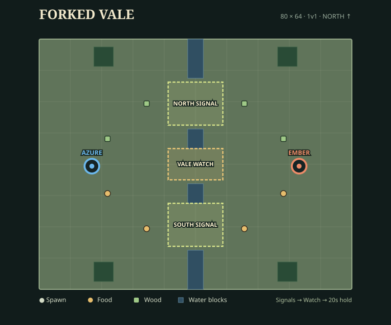

# Forked Vale

[Documentation index](README.md) · [Map catalog](maps.md) · [Balance](first-skirmish-balance.md)

The default 1v1 map is an 80 × 64 economy and objective scenario. Each seat starts
with four Workers, eight Infantry, 150 food, and 250 wood. The opening choice is
to contest a signal, split the army, or invest in production.

## Rules

| Objective/event | Rule |
| --- | --- |
| North Signal | Five units, nine-second capture; 75 food and 50 wood per capture. |
| South Signal | Same requirements and reward. |
| Vale Watch | Eight units, twelve-second capture; requires ownership of both Signals. |
| Victory | Own all three for twenty continuous seconds. |
| Relief Caravan | At 2:00, both teams receive 100 food and 75 wood. |
| Deadline | At 15:00, the Watch owner wins; unclaimed means draw. |

Workers count toward capture thresholds. A five-Infantry north / three-Infantry
plus two-Worker south split exposes the economy and can be contested; its
scripted tradeoff is recorded in [balance](first-skirmish-balance.md).

## Layout

Spawns are mirrored at x = ±26.5. Each base has 600 food and 600 wood nearby and
400-stock food/wood expansions nearer the fords. Central water leaves north,
center, and south crossings of 13, 9, and 12 cells.

Both seats have shortest walkable routes of 31 cells to North, 30 to South,
and 20 to the Watch. Equality of routes is a geometry check; playtests determine
whether both plans are viable. The map also fits the manual 2,000-unit stress reset.

## Author and validate

- `node scripts/author-forked-vale.mjs` drives Map Studio, writes the shipped JSON,
  and reopens it to verify the editor round trip. It is a content-writing tool.
- `node scripts/forked-vale-layout.mjs` checks symmetry, routes, crossings, and
  formation space.
- `node scripts/forked-vale-scenario.mjs 0` and `1` check both winner assignments,
  economy, prerequisites, recapture, victory, and rematch.
- Add `--stress` for movement and combat with 2,000 total units.
- `node scripts/render-forked-vale-preview.mjs` refreshes the diagram from JSON.

The authoritative definition is [maps/forked-vale.json](../maps/forked-vale.json).
