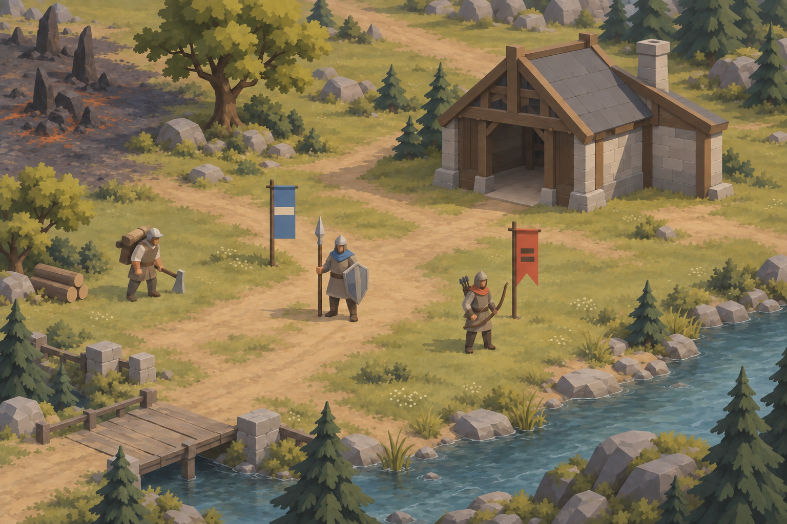
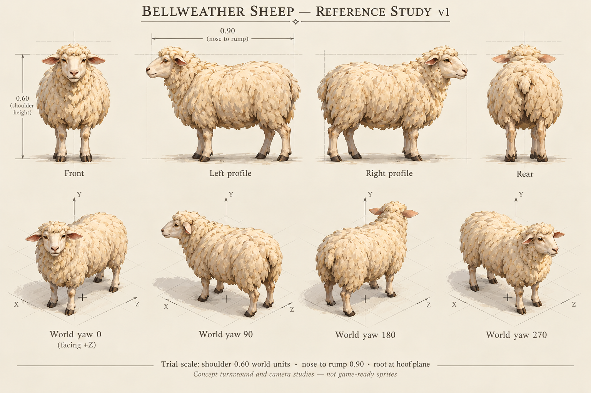
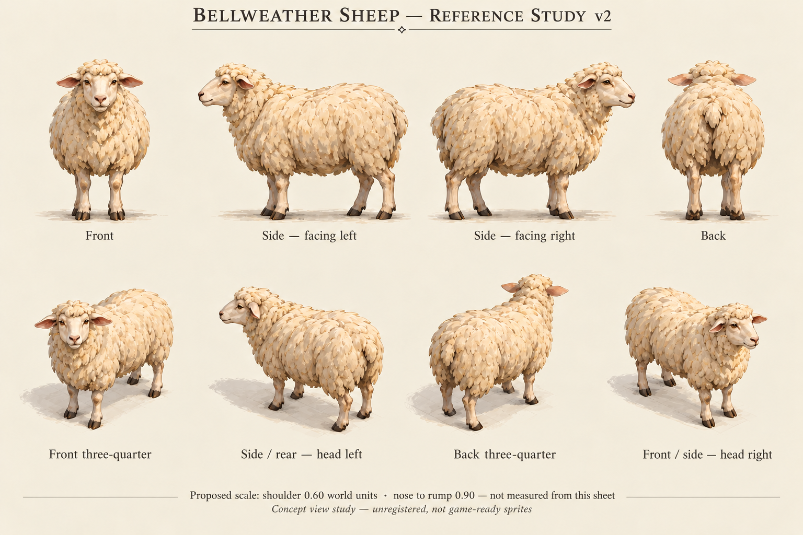
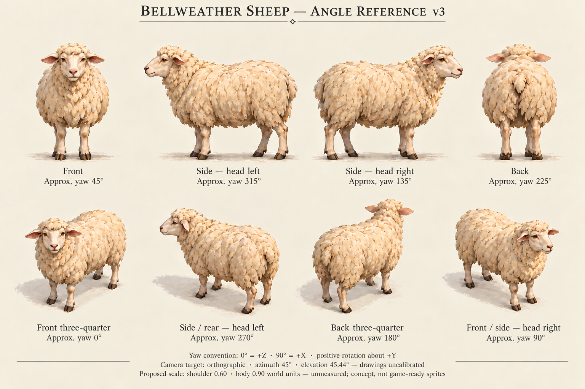
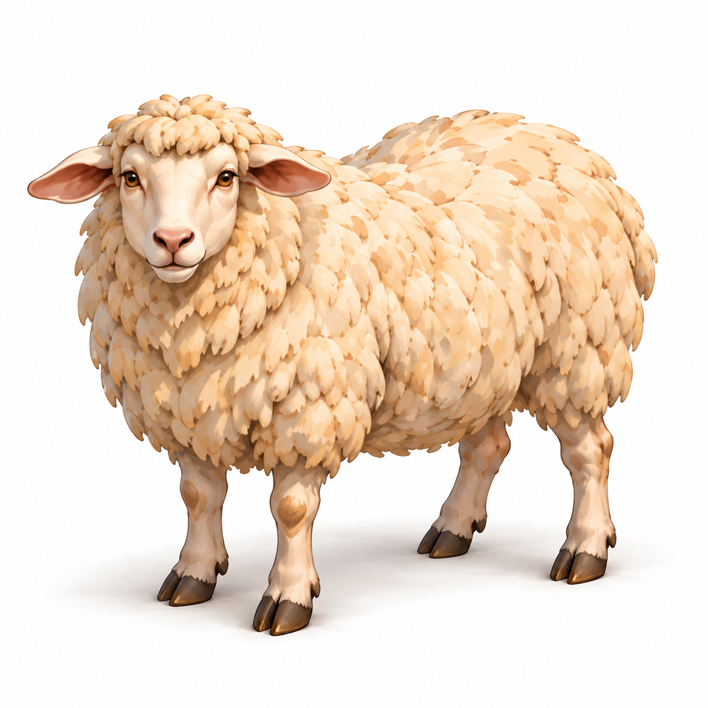
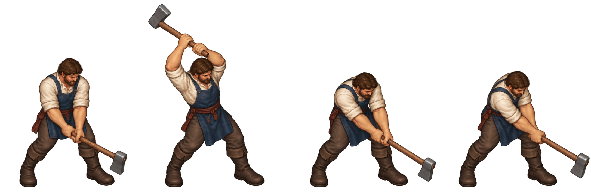
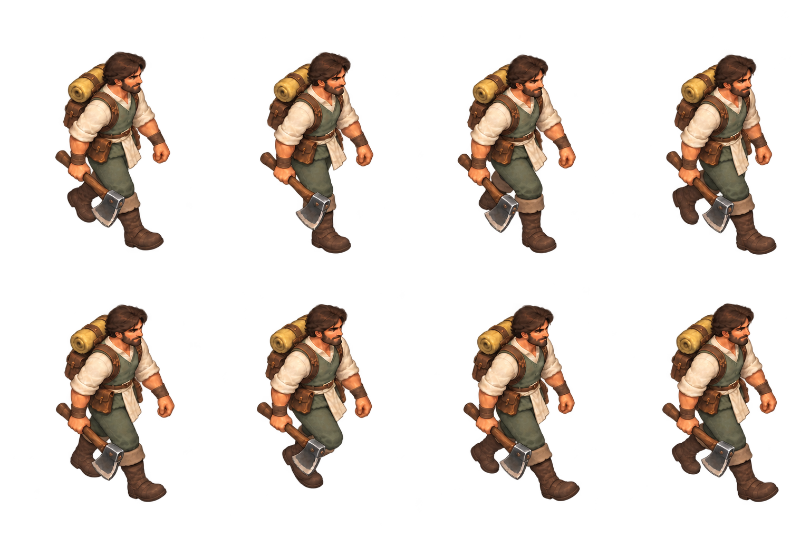
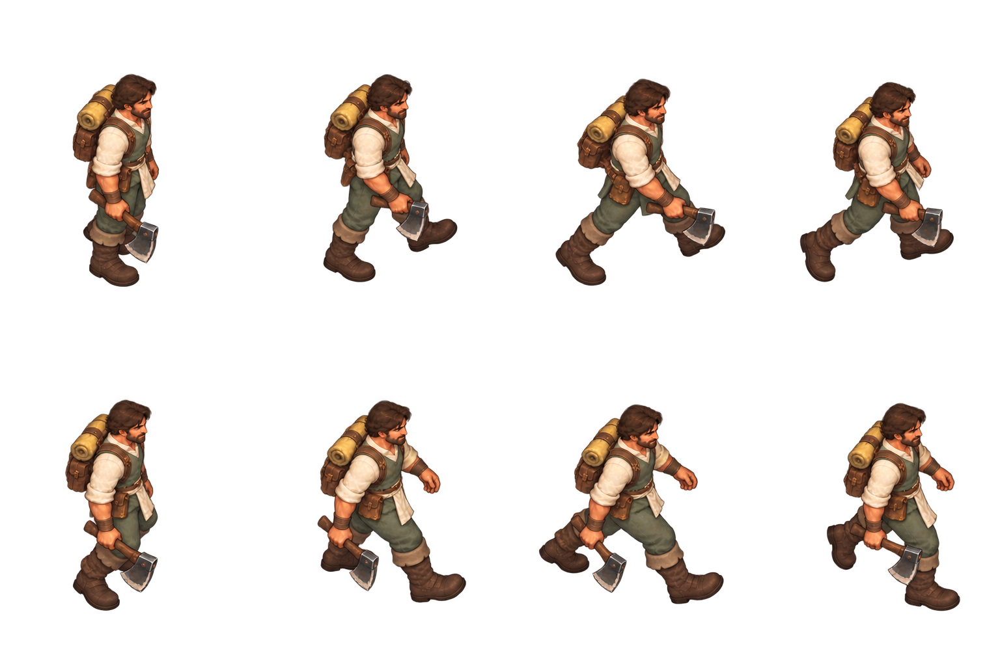
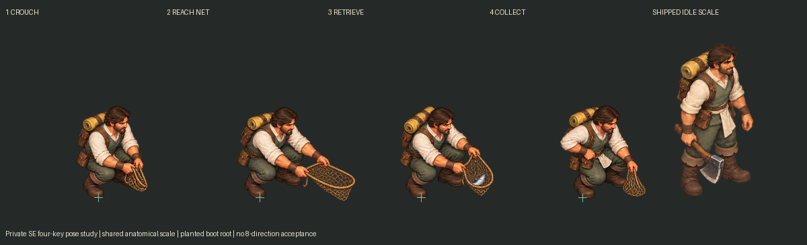

# Vaelora art evolution

**Status, 2 October 2026:** index of existing tracked exploration at fork main
`9990ed3`, plus an explicit recovery register. This page adds wiki access to
saved iterations; it does not recover absent files or approve rejected art.

## Direction before the regional atlas

The 26 September study remains a historical visual starting point. The
[dated review](../archive/2026-09/art-direction-contract-v1.md) preserves its
context and limitations. The selected Vaelora checkpoint supersedes its visual
direction; supersession does not remove its value as a record of the work.

## Selected world and regional keys

The [29 September collection](../art-direction/vaelora-v1/README.md) retains the
[world atlas](../art-direction/vaelora-v1/world-atlas.png), ten zone maps and ten
ecology keys. Each region already embeds its selected map/key in this wiki.
All 21 manifest entries match tracked bytes, dimensions and SHA-256 values in
this audit. All ten ecology keys and the Bellweather map were visually inspected;
this is source-art review, not game appearance acceptance.

[Wildlife](wildlife.md) begins a species design from these actual keys. The
collection also contains three audio-audition screenshots; they are separate
evidence, outside the 21-image generated concept manifest.

## Anatomy and appearance experiments

### Bellweather Sheep — 2 October source candidate

The [first Sheep reference sheet](../art-direction/bellweather-sheep-reference-v1/README.md)
is a new built-in ImageGen attempt based on the selected Bellweather key.
Its [exact prompt](../art-direction/bellweather-sheep-reference-v1/PROMPT.json),
[manifest](../art-direction/bellweather-sheep-reference-v1/manifest.json) and
[review](../art-direction/bellweather-sheep-reference-v1/review.json) preserve
the output and its defects. Anatomy is a discussion candidate; world-yaw
registration is rejected pending correction. Baked guide marks and dimensions
are not runtime camera/pivot proof. Retain this attempt when another revision
is produced.

The [v2 intermediate edit](../art-direction/bellweather-sheep-reference-v2/README.md)
removes misleading axes, pivot crosses and measurement bars, replacing yaw labels
with descriptive front/side/back labels. It is retained with its prompt, hash and
review even though the next request required degree-oriented references.

The [v3 angle-reference edit](../art-direction/bellweather-sheep-reference-v3/README.md)
keeps the visually approved Sheep appearance and adds approximate intended yaw
labels under the verified +Y/+Z convention. Top anatomy views and lower oblique
studies have different apparent viewing elevations. Printed angles do not prove
measured multiview geometry, camera, scale or pivot registration. The
[manifest](../art-direction/bellweather-sheep-reference-v3/manifest.json) maps the
eight panels for future angle-specific source use; no sprites have been extracted.

The [asset angle-reference standard](../asset-angle-reference-standard.md) now
requires labeled rotations appropriate to every asset type and separates concept
intentions from calibrated sprite acceptance. All three Sheep iterations remain
preserved with their exact prompts and dated review status. These historical
source candidates do not change the later approved static runtime pack.

The [Sheep model-reference pilot contract](../bellweather-sheep-model-reference-pilot.md)
selects one front-three-quarter source panel for possible cleaned input and fixes
the local camera/rotation/scale/root evidence required after a separately
authorized model task. No Meshy output exists from this slice.

The [single-subject model input](../art-direction/bellweather-sheep-model-input-v1/README.md)
is a further built-in ImageGen edit of v3's lower-left front-three-quarter Sheep.
It removes other specimens, labels and grids, retaining one complete animal for
the separately owned reference-model pilot. Approximate yaw 0 is recorded in its
sidecar/filename; this clean image is not a calibrated render or byte crop.
Its exact prompt/hash and review are saved; the parent sheets remain intact.

### Earlier Human and Orc studies

The existing [Human reference](../art-direction/neutral-human-reference-2026-09-29.png)
and [Orc reference](../art-direction/neutral-orc-reference-2026-09-29.png) precede
the [neutral chopping poses](../art-direction/neutral-human-chop-keyposes-2026-09-29.png)
and their illustrated paintover:

The [earlier dressed chopping study](../art-direction/painted-worker-chop-keyposes-2026-09-29.png)
is also retained. The [two-stage experiment record](../unit-character-meshy-pipeline.md#neutral-model-references-corrected-source-and-direct-test)
explains input roles and review defects; the
[feasibility record](../art-direction/neutral-human-chop-feasibility-2026-09-29.json)
retains measurements. The anatomy references' source/rights limits remain as
documented there; indexing them adds no new redistribution-rights claim.

The later [Vaelora Human direction set](../art-direction/human-vaelora-sprites-v1/README.md)
preserves separate facing/walk/chop/defeat sheets,
[exact prompts](../art-direction/human-vaelora-sprites-v1/prompts.json) and
[review data](../art-direction/human-vaelora-sprites-v1/review.json).

## Rejected and revised movement

The [Human production record](../art-direction/human-roster-v1/README.md) rejects
v2 for repeated leg arrangements. Direct inspection confirms closely repeated
strides; the image is retained so the failed experiment remains visible.

v3 shows different stride positions in direct pixel review. That does not prove
a smooth loop, exact heading or accepted registration. The subsequent
[v4 source](../art-direction/human-roster-v1/source/worker-walk-SE-v4.png),
[rejected front walk and reason](../art-direction/human-roster-v1/worker-front-walk-review.md),
and [eight-key front review](../art-direction/human-roster-v1/worker-front-eight-key-review.png)
remain available. This folder tracks 42 source PNGs (67,093,682 bytes), including
failed and revised candidates. Its prompt and coverage records preserve the
distinction between source availability and acceptance.

## Worker fishing study and approved SE release — 3 October 2026

The [Worker fishing record](../worker-fishing-animation.md) preserves a new
four-key south-east hand-net study against the approved shipped Human Worker:
crouch, reach, retrieve and collect. The private Library pose sheet, timed WebP
and source/runtime archive retain the exact generation request, original output,
seed, rejected/draft prompt distinction, hashes, extraction bounds and explicit
ground registration. The user subsequently approved public game-image release.
The [SE source and calibration record](../art-direction/human-roster-v1/fishing-SE-v1/README.md)
now preserves those art iterations in the repository; full 3D sources and private
capture receipts remain private. No paid Meshy task or credits were used.

The study is one actual heading and a blocking loop, with scale/root and creative
acceptance pending. It does not establish eight directional clips or regional
fishing lore. The default code integration keeps resource authority on land,
faces the derived water spot, and selects the four approved SE keys from Human
v3 pack 0.14.0 in default play. All other fishing headings use the exact-facing
shipped-art fallback. Initial cloud sandbox/storage failure prevented a
game capture. Later private Mac QA exposed the amber bank ring obscuring the
hands/net. The scoped
renderer correction draws that ring beneath the Worker sprite while retaining
its land, stock and fog contracts. A subsequent full private sequence confirmed
that order and a visually steady planted boot, but max reach stopped short of
actual water. The later source correction adds a measured reach-only rope/rim
contact and smaller bank/water feedback without altering approved actor pixels.
Subsequent complete native-game capture verified that cue's visible water contact,
bank-side collection and smaller marker readability without changing actor bytes.
Final smooth-loop/directional and deployed-browser acceptance remain open. A later
private east study retains two rejected direction attempts and an exact-camera
guided prototype; its new heading/contact still needs game pixel inspection.
The private handoff preserves capture attempts and Library
identities; the linked public record describes calibration pitfalls. Actor-art
regeneration was unnecessary for the marker correction. The later authorized
pixel integration retains the original four approved poses unchanged.

## Other preserved families

| Family | Saved source and evolution context |
| --- | --- |
| Human mounted/siege | [Three first-pass action sheets](../art-direction/human-mounted-v1/README.md); distinct static moments, approximate headings |
| Boughward | [Direction reference](../art-direction/boughward-roster-v1/direction-reference.png), [seven source sheets and production notes](../art-direction/boughward-roster-v1/README.md), [prompts](../art-direction/boughward-roster-v1/prompts.json) |
| Frontier buildings | [Eight illustrated concepts in this wiki](frontier-architecture.md), [source pack](../../assets/buildings/frontier-civilization-concepts-v1/README.md), [exact prompts/output references](../../assets/buildings/frontier-civilization-concepts-v1/prompts.json) |
| Perspective construction | [Measured camera, eight-heading guide and Root Oak proxy](../art-direction/environment-camera-v1/README.md); construction evidence separate from painted production art |

## Sheep static-reference cloud follow-up

The [dated Sheep cloud-capture record](../qa-evidence/bellweather-sheep-static-reference-2026-10-02/README.md)
indexes the producer's saved eight-view model reference and preserves a small
derived capture contract. Cycles CPU completed the color views with denoising
off; the rejected contact-shadow experiment remains diagnostic evidence. The
model's 42.035° face/body turn keeps nose yaw separate from locomotion facing.
Full private originals and the large bundle remain in Library, with identities
in the private handoff. No large binary is duplicated here; the complete
manifest was read, while the documentation worker's image materialization failed.

The later [Sheep delivery record](../wildlife-bellweather-sheep.md) owns the
approved eight-view default pack, claim/Herd behavior and pending new-export
publication. This dated producer reference does not release the private model
or newer private walk/graze/carcass art.

## Recovery gaps

| Gap | Verified boundary and next action |
| --- | --- |
| Earlier world/battlefield/culture iterations | The selected checkpoint explicitly recorded their omission. It gives neither a complete filename list nor prompts for those omitted outputs. No absent historical raster path was found in available `docs/art-direction` Git history. Recover the original outputs and selection reasons from the originating local session before claiming preservation. |
| Selected Vaelora prompts | Its manifest retains all 21 original `exec-…png` filenames and hashes, but no exact generation-prompt archive. Recover prompts from the source session; descriptions in the README are not exact prompts. |
| Storehouse before background extraction | Building prompts name original output `exec-d6e36a1a-b930-4599-90d5-4674fdebc3b6.png`. The selected `storehouse.png` exists and matches its manifest; the pre-edit output is absent from this checkout and the concept pack's available Git history. Recover and hash the original before adding a before/after entry. |
| Other Mac-only work | This cloud checkout cannot inspect the Mac's generated-image store, uncommitted worktrees or local skill directories. An absolute Mac path in a receipt does not prove the original still exists. Exact inventory requires a local tracked/untracked/ignored-file audit; no count of unseen files is claimed here. |
| Ignored generation directories | Root ignore rules exclude `assets/generated/` and `meshy_output/`. Local output there is not automatically preserved by a commit. Admit only reviewed source files to an explicit versioned pack, with provenance and a wiki entry. |

There is no private-manuscript recovery or publication in this slice. The
[source register](sources.md) retains that separate boundary. Available-history
checks cannot prove that an image never existed outside Git.

## Preservation practice

The [3 October low-bank shade study](../qa-shore-bank-shade-2026-10-03.md) retains
original and candidate renders at ordinary/strategic zoom, exact exported game
geometry/materials, camera checks, settings and hashes. Its inputs are the existing
public Shore Fishing map and ground texture. These are Cycles CPU studies with
simple material settings, not generated concept art or native default-match
screenshots. All four iterations remain saved; the new default bank cue is
separate from the already accepted animated water.

The [water surface study](../water-surface-study.md) records the current contours,
primary rendering references and a reusable opt-in comparison scene. Browser
startup failed in cloud, so it adds no claimed screenshot or new image iteration.

The 3 October Mac review subsequently compiled/linked the surface and ripple
programs on Apple M2 and checked the comparison, fallback and an actual match
pond. The user accepted this first pass. The [same record](../water-surface-study.md#verification-and-limits)
now distinguishes that owner-run visual evidence from the later tested live
fish binding and default integration. Saved screenshots remain in the user's
Library; this repository update does not copy their private bytes or claim a
newly generated image.

The [3 October building/environment audit](../art-runtime-audit-2026-10-03.md)
links all eight Frontier concepts to the six completed model records and 48
directional captures, distinguishes older default art, and records precise
lifecycle and cloud-source gaps. The Town Center's existing Complete captures
now have a bounded release preview path. The subsequent
[finished-building runtime](../frontier-building-runtime.md) adopts all six saved
Complete families in normal matches, with explicit missing-state
fallback. Its [source receipt](../qa-evidence/default-frontier-buildings-2026-10-03/source-images.json)
preserves hashes/decoded alpha bounds for all 48 existing frames; original
source records remain intact. Deployed normal-match screenshots remain pending.
The [ordinary-game acceptance recipe](../qa-frontier-building-adoption.md)
records the paid maps, interaction/state/camera checks and retained implementation
ownership while Mac QA is offline. Its map files are preparation, not screenshots.

The [Town Center authoring preparation](../frontier-town-center-authoring.md)
adds a reusable empty Blender camera/state scaffold using those preserved
capture records. Its camera mathematics and saved scene were checked; no model
import, derived lifecycle art or new image iteration is supplied by that work.

Keep each exploratory output under a distinct revision filename; retain rejected
attempts and the reason they were rejected. Record date, exact prompt, input
roles, source output ID, hash, dimensions, and selection/review status. For edits,
retain both before and after. Link the pack or gallery here when saving a new
iteration, then update the selected region/species entry if its direction changes.
Selection status and runtime acceptance remain separate.

## Military Complete iteration history

The [local military capture pack](../../assets/buildings/frontier-civilization-military-models-v1/README.md)
adds sixteen original Complete renders derived from the two already-public
concepts. The [architecture entry](frontier-architecture.md#local-military-building-complete-sources)
embeds their controlled front views. Geometry, project texture generators and
portable source scripts have recorded hashes. Native gameplay and full style
acceptance remain open; Barracks is taller/narrower than its illustration.

| Stage | Preserved artifact / status | Reason for iteration |
| --- | --- | --- |
| Older direct military sprites | [Barracks](../../assets/buildings/barracks-sprite-test-v1/README.md), [Range](../../assets/buildings/archery-range-sprite-v1/README.md) | Retained loading/construction/damage fallback and historical design |
| Selected cream/oak/sage concepts | [Original illustrated pair and prompts](../../assets/buildings/frontier-civilization-concepts-v1/README.md) | New architectural direction, not measured runtime images |
| First Barracks render and source review | Saved privately with original editable sources | Doorway/proportion refinement; static Worker overlay was not native proof |
| Interrupted source refinement | Saved privately with a failure note; not accepted capture metadata | Source guard failed, then the exact render process was stopped |
| First eight Barracks views | Eight rejected PNGs and model/scripts saved privately | Duplicate rear masonry produced a dark foundation strip; originals retained |
| First Range front view | Original PNG/model/scripts saved privately | Targets were hidden under canopy; moved forward, annex framing/windows added |
| Corrected Complete pair | [Sixteen registered original PNGs](../../assets/buildings/frontier-civilization-military-models-v1/README.md#registered-views) | Independent source review found no blocker to bounded Complete-only adoption |

Private rejected views and contact sheets have **not** been published in this
wiki. This register documents their preservation status without claiming
public visual access. Publication of that review history remains a separate
permission boundary. The source archive and corrected contact sheets remain
local after Library transfer was blocked; no successful Library save is claimed
for those three artifacts. Original concept/runtime files remain separate.

Avoid copying large images already in tracked packs. Recover missing local
sources first, check size/provenance/privacy, and use a bounded source-pack PR.
Deletion or disk cleanup must preserve artwork and dirty worktrees until their
recovery has been verified. A text receipt alone is not a saved image.

**Evidence:** [preservation audit](../art-direction/preservation-audit-2026-10-02.json)
records the original 2 October checked source hashes, counts, inspected pixels
and gaps. That original index used existing tracked files without generation,
Meshy, repaint or runtime capture. The dated Sheep reference packs retain one
built-in ImageGen sheet, two annotation edits and one isolated-input edit, with
separate exact prompts and pixel reviews. Their cloud model/render observations
remain producer-attributed. The subsequent military section records new local
model renders separately; it does not claim native gameplay pixels.

[Wildlife](wildlife.md) · [Wiki index](README.md) · [Documentation index](../README.md)
