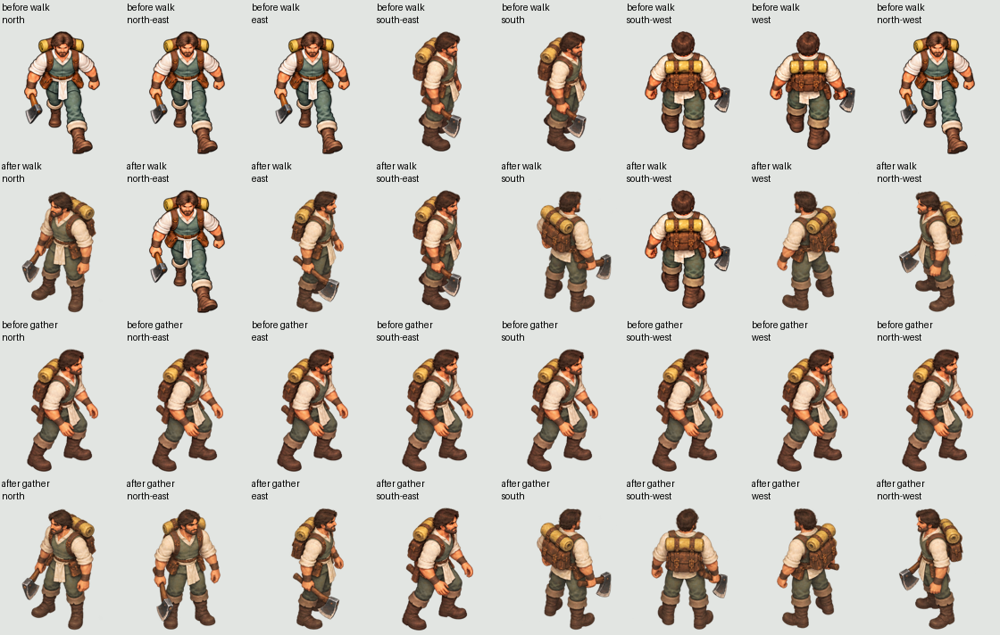

# Villager walk and gathering facing — 3 October 2026

Baseline fork main: `fdd91730725902852723917c831de4831b1611c3`. Player report:
villagers do not face screen-left when walking left or gathering berries to their
left. The report did not supply a deployed build, map, or seat. This reproduction
uses the default Human Worker pack and both seats in deterministic local fixtures
with the actual fixed camera `[0.78, 1.12, 0.78]`.

## Diagnosis and correction

`src/main.js` already derives world yaw from interpolated displacement using
`atan2(dx,dz)`; zero points along +Z. `src/unit-sprite-runtime.mjs` quantizes the
same yaw into eight directions. Screen-left/right/up/down are NW/SE/SW/NE under
the actual camera. Three.js instance UVs preserve X order and invert the top-down
atlas Y exactly once; quads use the camera quaternion. There is no additional
camera-yaw or horizontal-mirroring defect.

The default approximate action selector ignores exact idle holds and chooses
nearest animated headings. Its tie order sends screen-left NW walking to NE
(front/screen-down). The only animated food-gather clip is SE, so every gather
heading resolves to the right-facing action. Exact Human walk/gather selection
now preserves the requested direction and its authored idle hold where needed.

Separately, snapshots had no resource-facing heading. A worker approaching on a
different path segment kept that arrival yaw during work. Optional row index 15
now supplies world yaw from the authoritative resource node or forest cell only
in the actual gathering phase. Ownership/fog filtering occurs before emission.
The client clears missing headings on each snapshot, uses a valid work heading
after interpolation settles, and retains movement/attack precedence and existing
turn speed, displacement epsilon, animation clocks and authored frame durations.

## Pixel evidence and art limits

[Selection record](selection.json) runs the baseline selector and fixed selector
against the same manifest for all eight headings. [Decoded pixel audit](pixel-audit.json)
records runtime image hashes, every selected rectangle's RGBA hash, per-clip
pixel-frame count and duration for Human v3, Boughward v1, legacy Human v1 and
Meshy Worker v3. Both source/runtime PNGs for Human v3 are byte-identical. Sheet
reordering in `scripts/build-human-walk-preview.py` already registers screen-order
idle sources to world yaw; changing it again would introduce a second rotation.

The [before/after contact sheet](before-after.png) composes actual atlas pixels
with Pillow. It is a CPU source-pixel comparison, not a game/GPU screenshot.
Columns are world N, NE, E, SE, S, SW, W, NW. The final column is screen-left.

Human v3 has eight unique idle views; eight distinct animation frames at each
of walk NE/SE/SW; and eight food-gather frames only at SE. Other walk/gather clips
hold their idle view. Boughward v1 has one identical pixel pose across all eight
labels for each inspected action, with one static frame per clip. It cannot face
left correctly through heading code alone. Legacy Human v1 and Meshy Worker v3
have eight distinct directional action sets; their exact runtime paths remain
unchanged. No asset pixels, pack ordering, mirroring or animation timing changed.

## Checks and limits

`node --test scripts/villager-facing.test.mjs scripts/unit-sprite-clock.test.mjs scripts/audio-worker-snapshot.test.mjs`
passes 24 tests. Seven new focused tests cover all eight camera-projected headings
and angle wrap/boundaries; real atlas walk/food-gather selection; left/right
berries; arrival/work/idle transitions; queued path turns; near-zero jitter;
attack precedence; both-seat resource/forest heading snapshots; fog omission;
attack/audio wire indices; zero, cleared and legacy work headings; and runtime
UV/matrix selection. The runtime test uses real Three.js geometry and matrices
with a texture-loading stub, not a GPU renderer. The sprite clock suite still
verifies generation resets and default durations.

An additional 22 tests pass for CI registration, served import traversal,
seat-private production, rematch ownership and decoded pixel bounds. Syntax and
whitespace checks pass. The new regression is registered in `scripts/ci.mjs`.

`CHROME_PATH=/usr/bin/chromium node scripts/browser-preflight.mjs --launch` failed
with `sandbox-unavailable` and `storage-unavailable`; no screenshot was produced.
No sandbox override or security change was attempted. Actual GPU appearance,
human motion acceptance and a deployed-match observation remain unobserved.
This code fix does not supply missing directional action art.

The Sheep lane's open PR #35 consumes isolated preview modules and does not edit
these unit-facing interfaces. No shared renderer edit needs a cross-task decision.
