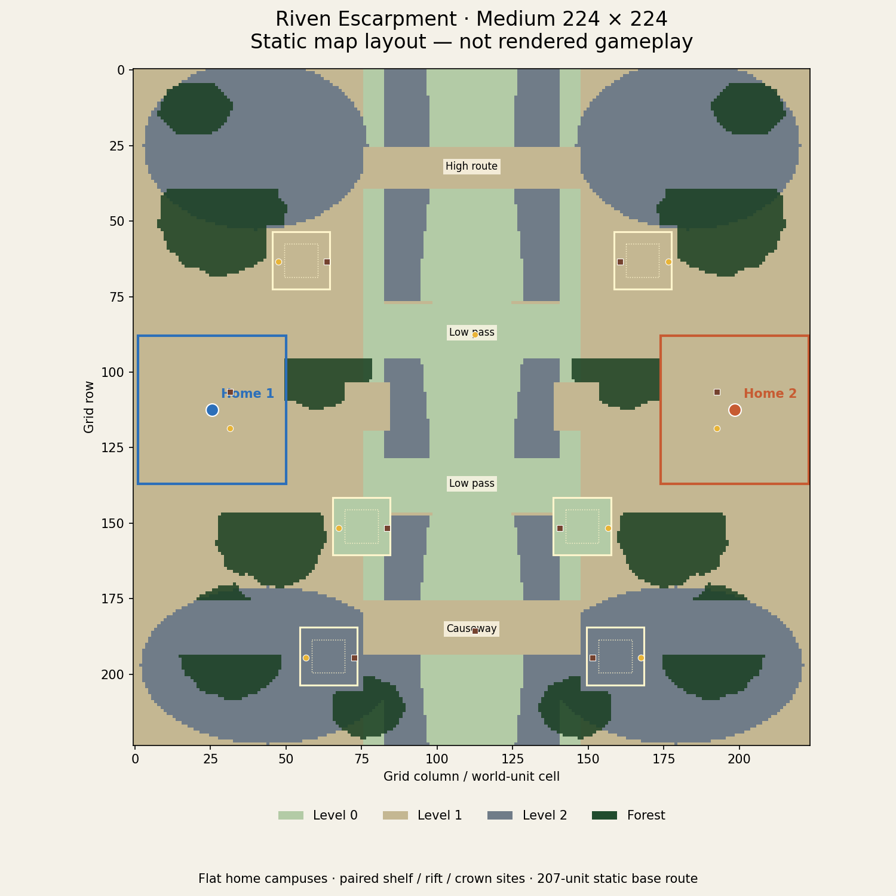

# Medium Riven Escarpment — 4 October 2026

[Map](../maps/veyrholds-riven-escarpment.json) · [Generator](../scripts/generate-riven-escarpment.mjs) · [Elevation capabilities](map-elevation-capabilities.md) · [Continuing stream](map-scale-playability-backlog.md)

Owner: map scale/playability workstream. This authored 224×224 source candidate
adds useful rift, escarpment and settlement space beyond Small, with ordinary
24 total units, 150 food/250 wood per seat, existing prices/audio and fog.
It uses Authored elimination fallback, with no triggers, deadlines or supplies.
It does not change the default, simulation cell/speeds, economy profiles or the
256 limit. Skirmish/PvE registry admission remains separate mode-owner work.

## Measured layout

| Measurement | Current source |
| --- | --- |
| Dimensions | 224×224 cells/world units; 50,176 gross cells; 44.8 constructed-TC widths per side |
| Usable ground | 43,734 cells (87.2%); every usable cell reachable from either home |
| Static construction ground | 43,716 cells (87.1%); 37,328 flat legal 3×3 centers and 31,468 flat legal 5×5 centers |
| Base route | 207 units / cost 20,715; 79.615 Worker/Infantry seconds, 46 Scout seconds; forest clearing preserves 207 |
| Complete forced routes | Two 18-row low passes: 207 each; 18-row southern causeway: 301; 14-row high northern route: 319 |
| Settlements | Two flat 49×49 home campuses; both fit the static 30-building template with circulation rings, adding 96 House population each |
| Expansion space | Three pockets per seat; each has a flat 19×19 pad, resource-free 11×11 inner ring and 23×23 forest clearance |
| Home resource access | 12 route cells for food and wood |
| Paired expansion food/wood access | Shelf 71/87 cells; rift 81/97; crown 113/129; reflected between seats |
| Finite stock | 12,100 food / 14,950 ordinary wood; 38,460 additional forest wood potential at six per initial forest cell |
| Elevation | Level 0: 9,518 cells; level 1: 23,592; level 2: 17,066 |
| Fog | 12,544 packed bytes per seat, before base64/compression |

Legal centers overlap and are not building capacity. The city fit is a constructive
static geometry example, not paid runtime or maximum capacity. Shared added-building
and population limits stay unchanged. Stock is authored per site, not multiplied
by map area; the home stock/access remain Small's while later pockets gain stock.
The crown pad is level 2, shelf level 1 and rift level 0, all with reachable access.

The center column lies in the open low rift and therefore appears fully open in
the generic audit. It is not the bottleneck. The focused tests mask both actual
ridge columns outside each named strip and verify a complete alternative through
that strip. This is a geometry test, not a minimum cut, measured army throughput
or proof that players use each lane. The outer ridge ramps also connect ridge-top
ground; no inaccessible high islands or decorative unusable padding are counted.



## Repeat and evidence scope

```sh
node scripts/generate-riven-escarpment.mjs
node --test scripts/riven-escarpment.test.mjs scripts/map-scale-audit.test.mjs scripts/map-size-policy.test.mjs scripts/map-grid-cost-audit.test.mjs scripts/threefold-basin.test.mjs
node scripts/map-scale-audit.mjs --summary-jsonl
node scripts/map-grid-cost-audit.mjs
node scripts/riven-escarpment-practice-scenario.mjs --output /tmp/medium-practice-NEW.json
node scripts/map-capacity-scenario.mjs --map veyrholds-riven-escarpment --loads 24 --seconds 10 --output /tmp/medium-NEW-evidence
```

The source checks cover deterministic authoring, all-ground connectivity, four
forced routes, flat settlement/resource pads, symmetric access and finite stock.
The existing bounded native collector now accepts this map and sends three waves
towards its actual low pass, high route and causeway. Its short order windows do
not establish full army arrival, lane choice, paid city growth or supported scale.
Any process telemetry is a shared-host diagnostic, separately identified from
static accounting and rendered browser testing.

## Accepted source and process receipts

The [sealed bundle](qa-evidence/riven-escarpment-2026-10-04/README.md) retains raw
receipts, summaries and byte-exact hashes. Map SHA-256 is
`42824ee5b4a4f9ef63df3961c2737ca37d3f71a61937d55860dec830ec38d2eb`.
All 24 focused checks pass, as do strict checked-JS/Node types, import graph,
docs and diff checks. Independent source review at `3750ef09` confirmed the
topology, resources, settlement metrics and elevation assessment. Final review
also covers the later evidence and repeatable Practice CLI.

Clean native source `3750ef0911e751f8148f3bb4aa49b422fc7a86a4` passes all three
24-unit diagnostic waves with 300 post-acceptance game ticks each. All 12 actors
per seat moved in each window; six plans had zero route failures, all captured
budget windows passed, all skipped-slot deltas were zero and cold recovery passed.
Window clocks are 0.999818–0.999909 game seconds per wall second. Across every
captured rolling window, peak tick p95 was 2.310 ms, maximum 4.494 ms; peak
start-lag p95 1.573 ms, maximum 8.292 ms; maximum planning slice 2.754 ms.
Peak server RSS was 106.039 MiB. These values describe a shared-host 24-unit
diagnostic, not a comparative benchmark or supported capacity. Final notice
receipt is 3.645–40.333 ms; first observed movement receipt 56.606–129.913 ms.
Neither is exact server application or full route arrival.

The separately repeatable public Practice smoke passes at clean source
`046d9f07ab870a69712ece1e229b0ca61347fec6`: canonical 224 map selection, 12,544-byte
private fog per seat, actual cold stop/start/resumed seats, unchanged map/match
identity and opening stocks/banks, then one-human Worker movement/clock.
It adds no money, cargo, positions or checkpoint fixture and does not test paid
city growth. The native diagnostic and protocol smoke retain their own sources.

Static grid accounting projects 4,430,624 resident typed-array bytes,
1,605,632 bytes at the existing attack-flow cache limit and 10,838,016 bytes for
the raised base ground geometry, before additional blended surfaces/side faces,
JS/runtime overhead and GPU allocations. The 16-bit index witness remains
50,175 without wrapping. This is allocation arithmetic, not measured whole-room
memory or browser frame cost. The 256 limit is unchanged; 320 remains rejected.

The initial brief/schema startup failure and earlier dependency-symlink dirty
run remain labeled diagnostic. No failed/dirty receipt becomes clean acceptance.
Packaging at clean `046d9f07` contains the byte-identical map in 1,178 files,
digest `sha256:f01836bb50487c93e84ad76e7f418f6d4ad268b62645f53684054d2c708efdac`.
This is local release inclusion, not served or deployed acceptance. Final
integration/release identities are recorded on the owning PR.

Rendered browser testing has not run for this Medium revision. The executor's
prior bounded Chromium launch failed before navigation at its sandbox helper;
no browser appearance, picking/minimap or frame-memory result is claimed here.
The layout above is explicitly a static schematic. Delivery owner task `01a10227-2c6d`
retains identified staging/browser follow-through; mode owner task `01a103cc`
retains explicit Skirmish/PvE admission. Human balance, paid full-match acceptance,
larger load comparisons and browser capacity remain open. Large 256 remains the
next authored tier. XL requires the separate index/cache implementation, not a
validator change in map authoring.
