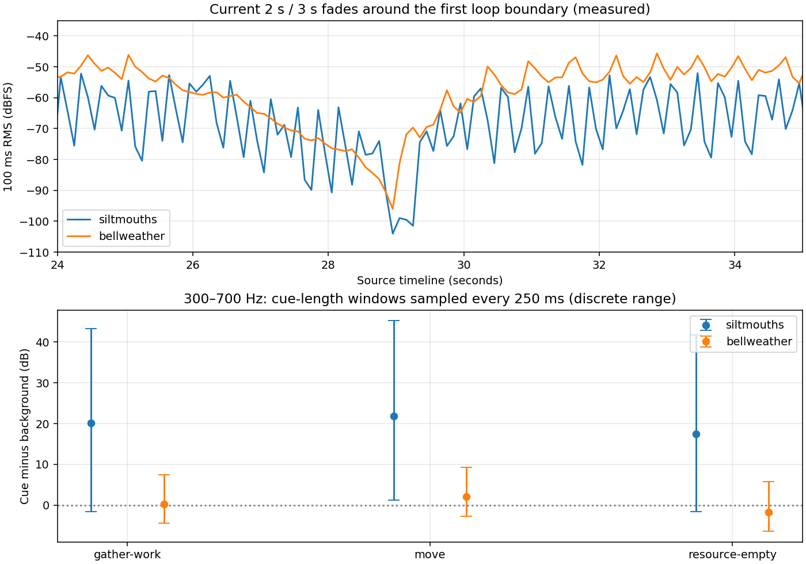

# Shore Fishing score and water-bed comparison — 3 October 2026

[Coverage and reuse plan](qa-audio-coverage-2026-10-03.md) · [Runtime](audio-runtime-packs.md) · [Measured data](qa-evidence/audio-shore-2026-10-03/measurements.json)

**Recommend the existing Siltmouths music + contrast-water pair as the first
human audition candidate.** At the documented normal mix it leaves more measured
space for the current food and depletion cues than Bellweather. This is a
provisional ranking from decoded PCM and reconstructed cues, not a heard-quality
judgment, psychoacoustic masking pass or default map assignment. No runtime,
map, shipped profile or source master changes are included.

The four originals were read from fork main `edf93b3dd07d7a578e72c4d19f9c9e92e2f1d12a`.
Their SHA-256 hashes match the existing regional catalog. This reuses the
existing authorized local files; no provider generation, rights expansion or
public audio upload occurred. The recorded provenance is not a new license
verification. Existing [rights notes](audio-kit-plan.md#music-rights-boundary)
remain separate from this private audition.

## Exact comparison and scope

Both pairs use one complete music source and their own contrast-water source:
`siltmouths-music` + `siltmouths-contrast`, and `bellweather-music` +
`bellweather-contrast`. The water source replaces the terrain source only in the
offline render. The comparison keeps the [Mac recipe](audio-design.md#short-mac-listening-session)
mix: Overall 25%, Effects/Voice 100%, Music 50%, Ambience 40%. It does not match
source loudness or normalize the resulting audio.

The steady runtime factors are master `0.25 × 0.78`, effects `0.52`, music
`0.50 × 0.55`, ambience `0.40 × 0.18`; existing track gains are music `0.35` and
bed `0.6`. Each independent composition repeats on its current timeline:
29.024 seconds for music and 29.040816 seconds for the bed, with two-second
linear entrance and three-second exit fades. Catalog MP3 durations include
padding; all four files decode to 30 seconds of PCM at the analysis rate.

The offline players start together at modeled time zero. Real players choose
separate Web Audio starts after asynchronous decoding; actual relative startup
phase was not captured. Combined fade-valley timing and first-cycle comparisons
therefore assume that relative phase. Individual source periods and fades are
measured directly. These independent complete mixes are not synchronized stems.

The current unbound regional profile uses synthesized gather/work, Move and
Resource empty cues. The recipe reconstructs their triangle oscillators,
exponential frequency sweeps and gain envelopes analytically at 48 kHz. It is
not a browser render: oscillator implementation, initial bus smoothing, output
hardware and player actions are outside this comparison. The committed recipe
requires FFmpeg and Python with NumPy, SciPy and Matplotlib; it installs nothing.

## Measured cue interference

The table compares cue RMS energy to the combined background over each cue's
70/90/110 ms active window, sampled every 250 ms between the entrance and exit
fades. There are 96 discrete positions per cue/pair, 576 normal-mix windows in
all. A positive ratio means greater cue energy in that window; it does not
establish human recognition or absence of masking. Minima cover sampled windows,
not every possible instant or relative bed phase.

| Cue | Siltmouths median / sampled minimum | Bellweather median / sampled minimum |
| --- | --- | --- |
| Food gather/work, broadband | +12.7 / −2.9 dB | −2.8 / −8.2 dB |
| Move, broadband | +16.0 / +0.7 dB | −0.1 / −5.6 dB |
| Resource empty, broadband | +5.3 / −2.9 dB | −4.6 / −10.3 dB |
| Food gather/work, 300–700 Hz | +20.1 / −1.6 dB | +0.3 / −4.5 dB |
| Resource empty, 300–700 Hz | +17.5 / −1.7 dB | −1.7 / −6.5 dB |

At the same gains, Siltmouths has lower source RMS: music −23.9 dBFS versus
Bellweather −16.0, and water −38.1 versus −24.9. Its quiet background explains
part of the advantage; that does not prove the water bed is perceptually present
or that its dynamics are preferable. Both pairs have transient overlap with
short cues, and neither clips in the render. Reducing Music from 50% to 25%
improves the sampled worst 300–700 Hz ratios: Siltmouths food/depletion become
+4.4/+4.4 dB; Bellweather becomes +1.4/−0.5. Keep that as an audition alternative,
not a global settings change.



## Loop boundary

The current fades remove a hard discontinuity from the modeled cut, but both
arrangements have a substantial repeating level valley. Over one second centered
on the boundary, music is 18.4 dB below settled RMS for Siltmouths and 25.0 dB
below for Bellweather; water is 20.7 and 18.0 dB below respectively. The chart
shows the assumed near-coincident valley. This is a measured power drop, not a
heard click, pause or accepted seam.

The unfaded Siltmouths music cut has a larger sample step (−17.8 dBFS) than
Bellweather's (−45.5). Retain the current fades for the first audition; simply
looping the unedited original would discard that treatment. If the recurring
valley is heard as distracting, compare an edited boundary or a short bed
crossfade in a private draft before making a runtime arrangement change.

## Private listening sample and next decision

The saved private comparison is named
`shore-fishing-siltmouths-then-bellweather-normal-mix.wav`: 48 seconds, 48 kHz,
stereo, 24-bit PCM, unchanged gains, no normalization or limiter. No audio bytes
are committed to the repository. The sample includes reconstructed cues and
these passages:

| Time | Passage |
| --- | --- |
| 0–14 seconds | Siltmouths at normal mix; food/work, Move and Resource empty. |
| 15–29 seconds | Bellweather at the same source timeline and cue schedule. |
| 30–38 seconds | Siltmouths loop boundary at 34 seconds. |
| 39–47 seconds | Bellweather loop boundary at 43 seconds. |

One-second silent dividers are deliberate. The WAV uses 24-bit PCM so the quiet
fade tails are not truncated to the earlier 16-bit sample's extra silence. Its
hash and exact cue times are recorded in the measured data.

This session's audio-input tool returned that audio input was unsupported, so
neither candidate was heard here. Separately supplied Mac QA at `8c9a29fb`
verified mute/mix persistence through reload and captured 5.04 seconds of actual
internal browser master-bus audio without speaker output. That is capture proof;
it does not establish human listening, these regional seams or later PR #78
acceptance. Mac QA is currently offline.

The next decision is a short human comparison of this private sample: record
output/headphones, whether the food/depletion cues are identifiable in each
passage, whether Siltmouths' water identity is present, and whether the two seams
are distracting. Prefer Siltmouths if those observations support the measured
ranking. Only then choose a map profile or edit the loop treatment. Existing
fog/ownership/event gates need no new observer for an authored score/bed choice.

## Reproduction and independent review

Run the optional measurement tool from the repository; outputs remain outside
tracked assets:

```sh
python scripts/audio-shore-audition.py --repository . --output /tmp/tus-shore-audition
```

It verifies all four source hashes, validates finite PCM, uses current manifest
gains/fades, measures the full discrete comparison and writes the private WAV,
full measurements, concise summary and chart. The recorded run used Python
3.12.14, NumPy 2.3.5, SciPy 1.17.0, Matplotlib 3.10.8 and FFmpeg 7.1.5.

Independent review reproduced all 576 normal-mix windows within 0.000002 dB,
confirmed the source hashes/periods/gains/envelopes, and checked the 24-bit WAV
against its reconstructed timeline within one PCM step. Its rough 0/7/14/21-second
bed-phase probe preserved the food-band median ranking (about 19.8–20.1 dB for
Siltmouths versus 0.28–0.31 for Bellweather), without claiming exhaustive phase
coverage. Review corrected probe labels, PCM precision and the explicit startup
phase assumption; no remaining measurement/artifact findings were reported.
Human listening and the aggregate game suite are outside this analysis.
