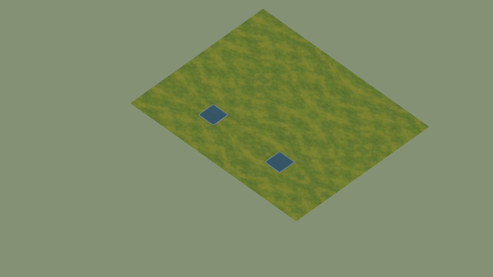

# Default low-bank shade — 3 October 2026

[Water guide](water-surface-study.md) · [Art evolution](lore/art-evolution.md)

Baseline: fork main `75f4b7b`. Apparent water depth, ground paint, forest cover,
regional haze and slope shading already exist. This slice adds a quiet shadow
immediately outside level-zero water banks. It is enabled in the ordinary game
through `createGroundSurfaces`, with no new preview permission flag.

## Runtime change and bounds

[The implementation](../src/shore-bank-shade.mjs) follows the same rounded
`waterContours` as the current water. Joined outer vertices extend 0.60 world
units toward land, with alpha falling from 0.14 to zero. The neutral dark-green
shade sits at height 0.008, above terrain paint and below water, haze, props,
units and the existing fog-of-war overlay. It keeps normal scene-distance fog.
Opaque water hides the inside portion. This is a painted value cue, not a
simulation of sunlight, bank height, bottom geometry or cast shadows.

Each map adds at most one static MeshBasic batch, no textures and no per-frame
callback. `forceSinglePass` avoids Three r180's default second draw for transparent
double-sided materials; this flat strip needs only one pass. It does not raycast
or read resources, stock, visibility or ownership.
Normal map teardown owns its geometry/material. Dry islands receive shade toward
their dry interiors; map boundaries create no imaginary shore. Raised banks are
omitted rather than bridged across a wall. No authored map, obstacle, route,
elevation, node position or food/wood budget changes.

| Shipped map | Added vertices | Added triangles | Extra batches / textures |
| --- | ---: | ---: | --- |
| Bellweather Millrace | 1,176 | 588 | 1 / 0 |
| Shore Fishing | 384 | 192 | 1 / 0 |
| Sombral Mere Shore Gardens | 4,624 | 2,312 | 1 / 0 |
| Underbough Rootways | 0 | 0 | 0 / 0; no qualifying water bank |

A strict limit of 4,096 quads bounds the new allocation to 16,384 vertices /
8,192 triangles (496 KiB of position, RGBA and Uint16 index buffers). A more
complex shoreline omits the whole decorative batch instead of drawing a partial
bank or allocating without a bound. These are CPU geometry counts and an
architectural budget; they do not prove GPU frame times in a crowded match.

## Controlled study: original and candidate are preserved

The installed browser's supported preflight returns `sandbox-unavailable` and
`storage-unavailable`; it produced no WebGL frame. The `game-dev` CLI is absent,
so no sealed game-dev capture or GPU/performance receipt is claimed. Installed
Blender 4.3.2 successfully rendered this bounded **Cycles CPU study**.

The [scene export](qa-evidence/shore-bank-shade-2026-10-03/scene.json) uses the
actual Shore Fishing map, actual `createGroundSurfaces` geometry/materials and
its existing public ground texture. Existing mirror texture sampling and original
static water quality give a faithful simple-material comparison. It does **not**
reproduce default stochastic sampling, animated water/fish, units, props, HUD or
fog. Neither image is a game screenshot.

Both versions use seed 13, eight samples, a 1280 × 720 canvas and the fixed game
camera direction. At each zoom, the baseline omits only the new bank mesh. The
renderer verifies four projected world points against the Three camera to within
0.001 pixel. Material approximation and missing match content prevent this study
from certifying native default appearance or player recognition.

| Zoom | Original study | Candidate study | Changed pixels above one RGB level |
| --- | --- | --- | ---: |
| 0.91 | [Before](qa-evidence/shore-bank-shade-2026-10-03/before-zoom-0.91.png) | [After](qa-evidence/shore-bank-shade-2026-10-03/after-zoom-0.91.png) | 2,546 / 921,600 (0.276%) |
| 0.48 | [Before](qa-evidence/shore-bank-shade-2026-10-03/before-zoom-0.48.png) | [After](qa-evidence/shore-bank-shade-2026-10-03/after-zoom-0.48.png) | 733 / 921,600 (0.080%) |



Direct inspection shows restrained darkening beside the pale rim; the pond shape
and wider field remain stable. Changed pixels average 2.48 / 2.32 RGB levels
darker at the two zooms. No changed pixel above the threshold falls outside the
projected bank geometry plus a three-pixel sampling margin. These measurements
localize the study delta, not artistic acceptance or performance.

[Render receipt](qa-evidence/shore-bank-shade-2026-10-03/render.json) and
[comparison/hashes](qa-evidence/shore-bank-shade-2026-10-03/comparison.json)
preserve all four original/candidate rasters, exact mesh/material input, camera,
map/source hashes and settings. The full evidence set is about 2.45 MB. Existing
art is referenced, not copied into a new source pack; no image generation provider,
paid job, private fish artwork or new sprite was used.

Study source hashes identify input commit `8e4d20f`. The later single-pass flag
reduces the WebGL draw count without changing exported geometry/material colors;
its separate hash is retained in the comparison record rather than rewriting
the original study input hashes. It adds no new visual iteration.

Reproduce into a **new** output directory:

```sh
node scripts/export-shore-bank-study.mjs /tmp/shore-bank-study-new
blender --background --factory-startup --python scripts/render-shore-bank-study.py -- /tmp/shore-bank-study-new
```

## Verification and remaining observation

`node --test scripts/shore-bank-shade.test.mjs scripts/water-surface-study.test.mjs scripts/water-study-fish-binding.test.mjs`
passes 22 tests. Seven new tests include the actual default ground factory,
static water quality, source immutability, alpha taper/non-picking, island
direction, dry/boundary/raised omission and pathological topology ceiling. The
contour scenario passes all 511 local footprints and 189,440 interior samples;
water surface, terrain atmosphere and terrain blend scenarios also pass.

Packed HTTP import-closure checking initially caught the new module missing
from the server's explicit public allowlist. The exact module is now admitted;
the release scenario also checks its served MIME and byte hash. This changes
asset delivery only, with no simulation or authority rule change.

Native observation remains: inspect an ordinary default match at zoom 0.91 and
0.48 beside Workers, resource rings and fog, including a narrow crossing and raised
bank. Measure the same crowded workload before claiming a GPU frame-time budget.
The bounded default geometry change ships independently of that observation;
it adds no shader, reflection pass, light engine or animation.
