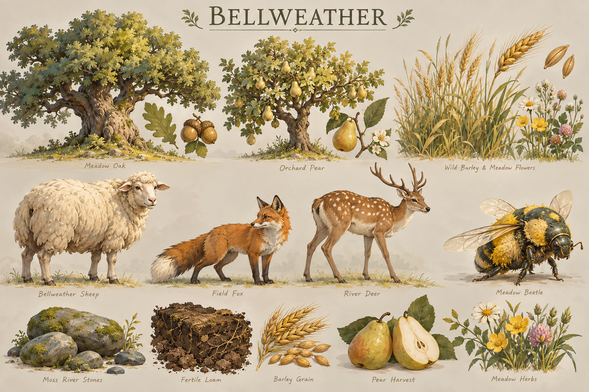

# Bellweather Sheep — first harvestable animal draft

**Status, 3 October 2026:** the original source-based proposal at fork main
`9990ed3` remains the claim/herd design. A narrower neutral food foundation is now
implemented below, with [six Sheep on the default Millrace map](qa-millrace-sheep-2026-10-03.md).
It delivers no new generated art or accepted animal stock/gatherer-cap balance.

[Wiki wildlife entry](lore/wildlife.md) · [Art evolution](lore/art-evolution.md)

**3 October art follow-up:** the [approved eight-view static pack](../assets/wildlife/bellweather-sheep-static-v1/README.md)
now replaces the earlier public-input illustration in the normal game renderer,
including default Millrace Sheep. All eight original PNGs were materialized,
visually inspected and preserved with provenance. Alive Sheep select their
authoritative body heading through the still-only legacy nose conversion; missing/failed art uses the geometric proxy, carcasses
use the food-cache marker, and depleted/hidden Sheep are suppressed. There is
no articulated animal animation or full model in runtime; the bounded motion
slice translates the existing static art. [Current evidence](qa-sheep-eight-view-default-2026-10-03.md)
records byte/pixel acceptance, simultaneous views, default both-seat game checks,
packaging and the pending native ground/scale/occlusion review.

Historical [one-view binding](qa-neutral-wildlife-render-binding-2026-10-03.md),
[offline readiness](qa-sheep-directional-readiness-2026-10-03.md) and
[static-pose runtime](qa-sheep-static-directions-runtime-2026-10-03.md) records
preserve the earlier transfer/publication limits. Those limits were resolved
for these eight approved PNG views; native appearance acceptance remains open.

The next [one-heading local walk candidate](sheep-local-walk-candidate.md) records
verified Blender/Rigify availability and producer-reported hoof landmarks.
The private GLB has since been recovered and source-verified by the read-only
inspector. A conservative local rig and one body-forward heading's actual walk,
graze and prone captures have cleared private source/deformation review. Eight
body headings and normalized atlas candidates have also cleared independent
source/pixel review; no new animal artwork is admitted to the game. The ranked backlog below
owns publication, binding, collar fitting and delivered appearance.

## Implemented neutral food foundation — 3 October 2026

[Authoritative state](../src/wildlife-state.mjs) admits one optional resource-node
identity, `wildlifeSpecies: "bellweather-sheep"`, only on existing `food` nodes.
Maps still specify the ID, coordinates and finite positive stock; no additional
food pool or currency is created. The node limit, open-cell, both-seat
reachability, construction-site and food drop-off rules remain the existing ones.
**Bellweather · Millrace** opts in with three existing 130-food markers per home
orchard; one is visible at each seat's opening. This preserves its total food,
IDs, positions, seed and build clearings. [Map schema](map-authoring.md#resources-and-forests)
contains the authoring contract; Map Studio's [resource brush](map-authoring.md#resources-and-forests)
preserves existing wildlife identity while appending ordinary patches.

The room worker starts each sheep `alive`. A seat's own living, gather-capable,
reachable Worker may issue the existing `gather` command with the node ID only
while its cell is currently visible. An accepted distant order leaves it alive.
The first authorized Worker in normal interaction range changes it once to a
stationary `carcass`; activation itself grants no food. Existing gathering then
moves stock into food cargo at the unchanged rate/carry limit and deposits at
valid food drop-offs. Either seat may gather the same visible carcass, regardless
of who activated it. Gather has no ownership restriction; automatic living claims are described below. Repeated orders and
interruption preserve the same stock pool; exhausting it sets `depleted` and
rejects new gathering. Wildlife adds no sight/population or path blocker
and is absent from combat targeting. No gatherer cap is introduced in this slice.

Live Sheep now alternate deterministic `grazing`, `idle` and `wandering` activity.
They take continuous steps at at most **0.18 world units/second**, inside a
**0.35-world-unit radius** and their original resource cell. Land traversal,
building/wall/TC masks and a swept 0.45-unit exclusion around living units/Sheep
check each step. Motion consumes no random stream, food, cargo or bank balance.
A valid pending Worker Gather order holds the Sheep at its current position;
Stop releases that hold, while harvest activation freezes a carcass there.
Authored definitions stay immutable, preserving fog cells, reachability and
construction exclusions. [Motion/recovery evidence](qa-sheep-motion-2026-10-03.md)
covers normal default Millrace and both seats. This is gentle positional motion
with existing static directional art; grazing/walking clips remain art work.

Visible state rows add actual `x`/`z` in world units, `wildlifeHeading` in radians
(`[0, 2π)`, body-forward zero faces +Z, positive turns toward +X), and live-only
`wildlifeActivity`. Sequence, target and remaining wait ticks stay private in
checkpoint schema **24**. Exact stationary schema23 saves initialize motion
without changing stock/cargo; schema24 restores current positions and progress.
Carcass/depleted motion stays frozen, including through recovery. The renderer,
resource click target, ring, callout and minimap consume disclosed positions;
missing/fog-hidden rows immediately hide and expose no remembered click target.
The motion slice adds no ownership. The subsequent automatic claim slice below
adds only a real team label; controllable herding and collar art remain separate.

### Canonical body heading — 4 October 2026

The shared [heading module](../src/wildlife-heading.mjs) defines canonical body
yaw for private `wildlifeMotion.heading` and public `wildlifeHeading`: radians
in `[0, 2π)`, body-forward zero along +Z, positive toward +X. Actual wandering
and Herd steps use `atan2(dx,dz)` without an art offset. The existing authored
`wildlifeNoseYawDegrees` remains a legacy nose input, including implicit nose
zero when absent. Initial body yaw is `wrap(nose − 42.03499984741211°)`; no new
authored field or map hash change is needed.

The admitted original standing views remain nose-labelled. Only their snapshot
adapter adds the exact offset back before sector selection; a standalone
authored fallback already contains nose yaw and adds nothing. The body-aligned
geometric proxy and future body-forward action frames use canonical body yaw
directly. Direction is the nearest 45° world sector, with exact half-sector
ties choosing increasing yaw: 22.5° becomes north-east and 337.5° wraps to north.
A `16 × Number.EPSILON` allowance in sector units absorbs floating-point tie
roundoff. Camera quarter rotations affect the existing billboard transform,
not world-heading labels or the nose/body conversion.

Checkpoint schema **29** converts exact schema28 Sheep private headings by
subtracting that offset once. Positions, motion sequence/goal/wait/activity,
Herd paths/progress, anchors, ownership, food stock, cargo and banks stay exact.
Frozen carcass/depleted headings also convert to preserve their former still
pose. An old moving save preserves its displayed pose at restore; the next
actual moving step recomputes body heading from its movement vector. The
schema23→24 initializer retains legacy nose yaw until the existing stance,
claim, mode and Herd migrations reach schema28; the final conversion then runs
once. Current schema29 restores never convert again. Invalid or ambiguous old
headings reject without partial conversion. [Focused evidence](qa-sheep-body-heading-2026-10-04.md)
records exact migration, sector and default still compatibility checks.

The private action art contract uses eight body yaws at 45° increments, original
512 px root `[256,256]` at 256 px/world and the normalized 128 px root `[64,64]`
at 64 px/world. Its walk has eight samples at a 0.216-world-unit stride: 1,200 ms
at wander speed 0.18 and 360 ms at Herd speed 0.6. A future action binding must
advance phase by actual visible movement distance and pause when stationary;
wandering uses walk, grazing uses the planted 3-second graze, idle uses idle,
and carcass uses the static prone pose. Depleted/undisclosed rows hide. These
shared contracts add no new art binding or appearance acceptance. The art owner
retains private packet transfer, publication and frame admission.

Alive Sheep now claim automatically when a living land unit is within **1.4
world units**, the Sheep cell is currently visible to that team, and the short
segment crosses only legal open land/elevation (including diagonal corner checks).
Workers, Scouts and other mobile land roster units are eligible; water units,
dead units, distant units and blocked approaches are excluded. No Claim click,
stock conversion or food reward is added. Any eligible current-owner presence
retains ownership; otherwise the nearest eligible unit claims or recaptures,
with exact distance ties settled by lower stable unit ID. Without a contender,
the last owner remains. Claim changes apply only while alive: carcass/depleted
labels stay frozen and shared Gather rights remain unchanged.

Visible rows and current checkpoint schema **29** carry `wildlifeTeam: null | 0 | 1`
(neutral, Azure, Ember). Claims grant no sight or population. Only the owner
may issue the separate Herd/Stop authority commands below. Exact schema25 saves initialize neutral labels without altering
position, private motion, stock, cargo or banks; older compatible migrations
chain through motion24 and stance25. Current saves validate/restore actual ownership. Authoring
rejects runtime team labels; rematch resets them to neutral. The public field
is the actual collar input for art task `01a101a8-fba6-7323-a40c-27efd0112007`;
collar art and ordinary Herd selection/order binding remain dependent work.
[Claim/recovery evidence](qa-sheep-claims-2026-10-03.md) records the owned follow-ups.

### Owner-only Herd authority — client entry pending

The server accepts `herd {nodeId,x,z,resourceEpoch,clientOrderToken}` and
`stopWildlife {nodeId,resourceEpoch,clientOrderToken}`. Resource epoch is the
existing snapshot `forestEpoch`; stale commands reject. The owner must currently
see an alive positive-food Sheep and the exact destination must be visible,
in bounds and legal land before any navigation lookup. Existing cardinal land
navigation supplies the route at 0.6 world units/second. No extra food, sight,
army unit, population or currency is created. Current position/heading/activity
remain the public pose contract; route and grazing anchor stay private.

Stop, accepted shared Worker Gather, recapture, harvest and depletion cancel
travel at the actual position. Arrival/cancellation stores a new local grazing
anchor, preventing travel back to the authored point. Carcasses freeze there.
Current positive food reserves its actual cell for construction, gate occupancy,
production and rally; depleted food releases it. New obstructions stop an
intersecting herd route before a save, with feedback only while the owner sees
the Sheep. Checkpoint schema 28 deep-copies the anchor, route object and path;
exact schema 27 saves gain no travel intent and preserve claims/food/motion.
Live old saves retain their authored grazing anchor; frozen saves use their
actual pose. Invalid current shapes, land cells, routes or lifecycle reject.

**Ordinary game entry is incomplete.** Wildlife worker now owns the separate
string-ID selection/order binding through the agreed HUD interface; see the
[HUD controls backlog](hud-controls-backlog.md). The default renderer admits
actual disclosed poses throughout map bounds, and minimap fog checks that same
current cell. Picking, rings and callouts follow the admitted pose. Hidden,
omitted and depleted rows disappear regardless of ownership. The existing
static artwork and carcass marker remain; this does not bind new animation.
[Relocated-client evidence](qa-sheep-relocated-client-2026-10-04.md) records CPU
and live-server checks. Herd selection/orders, build/wall previews and
disclosed-resource AI positions remain the next owned client slice.
Deployment/native appearance also remain owned follow-ups; see
[Herd evidence](qa-sheep-herding-2026-10-03.md).

Stop after depletion preserves a Worker's final cargo. Select that Worker and
choose **Return cargo** to deliver it to a reachable completed owned food drop-off,
then become idle. The authoritative `returnCargo` order accepts living own
gather-capable carriers and references no resource node; exhausted/stale Gather
orders still reject. Return intent and cargo use the existing checkpoint fields,
so restart during delivery neither replenishes sheep nor credits food twice.
[Interrupted delivery evidence](qa-interrupted-cargo-return-2026-10-03.md) keeps
the original failing fixture and both-seat recovery checks.

Positive final loads smaller than the snapshot's usual cent precision also remain
actionable. A `0.004`-food Sheep previously left real cargo after Stop, but its
rounded zero browser value disabled Return cargo even after restart. The snapshot
now preserves positive loads that would round to zero; the existing control can
deliver them once without changing stock, gathering or deposit rules.
[Fractional delivery evidence](qa-fractional-cargo-return-2026-10-03.md) covers both
seats, depleted sources and recovery with actual production client functions.

At zero stock, the depleted carcass also releases its construction exclusion
and stops contributing a resource access point to building-connectivity checks.
The browser releases only sites whose zero stock has been disclosed; unknown
or positive stock remains protected. This uses the same rule for ordinary finite
food/wood nodes. It neither moves animals nor replenishes stock, and all other
construction guards remain in force. [Depleted-site evidence](qa-depleted-resource-construction-2026-10-03.md)
proves both-seat paid construction and recovery on the cleared sites.

Checkpoint schema 20 saves species, lifecycle, stock and existing Worker intent/
cargo together. It validates `alive` only at full authored stock, `carcass` only
with positive remaining stock and `depleted` only at zero. Schema 19 ordinary
maps migrate without replenishment. Reconnect/restart retains partial carcasses
and untouched live sheep; an explicit rematch restores authored live stock and
resets the economy. There is no decay, reproduction, regeneration or restocking
inside a match.

Run `node --test scripts/wildlife-state.test.mjs` and
`node scripts/wildlife-food-scenario.mjs`. The disposable two-seat scenario uses
real map publication/orders, tests hidden/foreign-worker rejection, fractional
stock conservation with lost-cargo/duplicate-credit negative controls, shared
carcass access after Stop, partial/depleted recovery, both-seat deposits, rematch
and rejection of a contradictory saved lifecycle. Its fixture stocks are test
values, not balance choices. Accepted appearance, controllable herding, combat dispatch, regional
placement, AI-specific wildlife policy and browser match evidence remain separate
outcomes. The high-detail Sheep GLB is an art reference, not a runtime mesh. The
neutral client renderer is separate from unit heading and environment art owners.

## Wildlife workstream queue — 3 October 2026

The wildlife worker retains this ranked queue through normal integration and
verified delivery; useful small PRs ship independently.

1. **Bounded neutral motion** ([PR165](https://github.com/lbeezr/thousand-unit-skirmish/pull/165)).
   Merged `7d536563dda96a5aa8338a266c311f3a2c5ba8c5`, independently reviewed
   `adfba206891338f4a17d43a8f6cd2a1dc736b89f`;1323 unit checks and postmerge
   default scenario passed. Next: verify deployed default Millrace. Write scope: motion,
   room snapshot/recovery/tick, minimal disclosed-pose renderer/client binding.
   Browser SUID sandbox failure leaves native appearance incomplete; active
   Railway owner owns staging delivery in the adoption ledger.
2. **Automatic ownership** ([PR194](https://github.com/lbeezr/thousand-unit-skirmish/pull/194)). Implemented contract: living land units, visible alive
   Sheep, radius1.4 world units and a clear legal land segment (no walls/water/
   impassable elevation). Existing owner's nearby eligible presence retains it;
   otherwise nearest eligible unit claims/recaptures, exact ties by stable unit
   ID. Snapshot/checkpoint `wildlifeTeam: null|0|1`; ownership grants no food,
   movement, sight or population. Preserve existing shared Gather rights in this
   first ownership slice. Public team contract is the real collar input; no
   invented Claim click. Merged 2e6bca931c4ce05cce6ba1b0e6342a25bbb9aa02;
   reviewed 627554d90662612b1e470b7f734d478e331ebace, 1593 unit checks passed.
   Next: staging and ordinary-game claim/collar acceptance with the active art owner. Write scope: pure claims, tick/state recovery,
   both-seat fog/tie/blocked/claim-reclaim tests. Art task
   `01a101a8-fba6-7323-a40c-27efd0112007` consumes the real team field for collars.
3. **Controllable herding**. Server commands, bounded owner-only existing land
   navigation, live food reservations and schema 28 recovery are implemented in
   [PR205](https://github.com/lbeezr/thousand-unit-skirmish/pull/205). Next: independent authority review/merge,
   agree ordinary string-ID selection/order binding with the UI owner, then
   finish cross-cell renderer/minimap/build-preview and AI disclosure. Preserve
   the same food node ID/stock through motion, Gather, depletion and recovery.
   Authority checks use actual moving positions; ordinary client entry remains
   incomplete until that interface agreement and binding are complete.
   Acceptance: both seats issue real herd orders, blocked/foreign/fog-invalid
   orders reject, interruption/restart does not teleport food or revive carcasses.
4. **Art acceptance of activity/carcass/collar**. Consume verified admitted art
   from the active Sheep owner, retain explicit fallbacks, and check normal and
   strategic appearance at the identified deployed revision. No new generation
   or paid service is authorized by this queue.

The next herding authority contract uses one existing food-node ID, independent
of numeric unit selection: `herd {nodeId,x,z,resourceEpoch,clientOrderToken}`
and `stopWildlife {nodeId,resourceEpoch,clientOrderToken}`. The epoch is the
existing resource/forest epoch and stale orders reject. Only the current owner
may order a currently visible alive Sheep; the exact destination must be
currently visible, in map bounds and legal land before navigation lookup. Trial
travel speed is0.6 world units/second. No new sight or food is granted. Existing
land navigation supplies the route; Stop, recapture or accepted Worker Gather
cancels travel at the actual position. A persisted local graze anchor prevents
a stopped/arrived Sheep from returning to the original authored coordinate.
Moving-node construction, gate occupancy, fog, gather and checkpoint checks
remain part of the authority slice.

The agreed ordinary selection binding is separate `selectedWildlifeId: null|string`, owned alive Sheep
left-click selection, right-click/touch legal ground to herd, Stop, normal order
acknowledgements, and immediate selection clearing on fog/omission, recapture
or harvest. The renderer supplies only a currently disclosed selectable row;
HUD code must not use environment-capture diagnostics as gameplay state. That
client agreement authorizes the wildlife worker to implement this narrow path;
the HUD owner retains layout and the Sheep art owner retains new frames.

## Observed source

The 1536 × 1024 key's middle-left animal is labelled **Bellweather Sheep**.
Direct pixel inspection shows a deep cream fleece with broad overlapping locks,
a pale face, outward brown-pink ears, bare lower legs and dark hooves. No horns,
harness or magical ornament are visible. This one oblique illustration supplies
identity, not a turnaround, gait cycle, measured anatomy or transparent sprite.
Its SHA-256 is `043d3be76343e9e5c04850fe99be84333b977a7215e503152bf1ab9dc588ed40`.

The [regional map](art-direction/vaelora-v1/bellweather-map.png), also inspected,
shows irregular pasture beside oak groups, orchards, winding tracks and river
banks. Small pale animals appear in the lower pasture; their anatomy is too small
to settle a second design. Fenced cultivation and open grassy margins motivate
placement. They do not establish coordinates for a playable scenario.

## Regional inventory from inspected pixels

All ten ecology keys were opened at original resolution. Labels below are
provisional source labels; illustrative specimen sizes do not establish scale,
edibility or playable capabilities. Only the sheep receives a design in this slice.

| Ecology key | Visible fauna and distinguishing forms | Later design consideration |
| --- | --- | --- |
| [Bellweather](art-direction/vaelora-v1/bellweather-ecology.png) | Cream Sheep, orange Field Fox, spotted antlered River Deer, Meadow Beetle | Sheep first; deer could be a separate hunt outcome |
| [Underbough](art-direction/vaelora-v1/underbough-ecology.png) | Tusky Bough Boar, rust Squirrel, Bark Moth, leaf-covered Bough Deer | Boar would require a distinct threat/retaliation decision |
| [Sereward](art-direction/vaelora-v1/sereward-ecology.png) | Harnessed Antelope, large-eared Dune Fox, turquoise Oasis Beetle, Dune Lizard | The pictured antelope is a caravan animal; food use is unsettled |
| [Ellionar](art-direction/vaelora-v1/ellionar-ecology.png) | Jewel-Blue Kingfisher, Copper-Gold Scarab, Orchard Gazelle, patterned Garden Tortoise | Gazelle suggests a later mobile hunt candidate |
| [Veyrholds](art-direction/vaelora-v1/veyrholds-ecology.png) | Shaggy curved-horn Goat, dark Cleftwing Raptor, Stone Marmot, Furnace-Cricket | Goat suggests a later herd candidate with regional anatomy |
| [Pale Meridian](art-direction/vaelora-v1/pale-meridian-ecology.png) | Harnessed shaggy Pack Beast, long-eared Snow Hare, Starfeather Owl, Winter Moth | Pack role and cold habitat differ from the sheep pilot |
| [Siltmouths](art-direction/vaelora-v1/siltmouths-ecology.png) | Silt Heron, broad Mud Crab, Estuary Otter, silver Estuary Fish | Aquatic access would need separate economy/path rules |
| [Vesperra](art-direction/vaelora-v1/vesperra-ecology.png) | Many-eyed Ootilok, Vespermouse, winged Pale Glider, Sleepless Moth | Supernatural inhabitants have no implied food role |
| [Sombral Mere](art-direction/vaelora-v1/sombral-mere-ecology.png) | Silver-haired Merehart, Violetreach bird, translucent Lunescale fish, Mereveil moth | Preserve distinctive anatomy; no implied universal livestock |
| [Ru’Lora](art-direction/vaelora-v1/ru-lora-ecology.png) | Green-violet Loralisk and Fringe Lizard; interior Ashmites labelled dead specimen | Living fauna belongs to the fringe proposal; no interior herd |

## Proposed player loop

Explore a pasture, claim a small flock, move it to a defensible gathering place,
then trade its finite food for production. This follows the user's AoE-sheep
analogy while keeping Vaelora's observed animal identity. Wool is lore/craft
context, not a second resource in this pilot.

| State | Proposed behavior and player feedback |
| --- | --- |
| Unclaimed grazing | Small head dips and occasional short steps inside its pasture; no combat aggression. Visible selection says `Unclaimed · Food 100`. |
| Claiming | Automatic nearby living-land-unit claiming is implemented as specified above. Visible proximity and a clear land segment are required; authority resolves nearest/stable-ID ties and owner-presence retention. |
| Claimed / moving | Owner selects the sheep and orders a ground destination. Walk slowly, stay on passable ground, stop with a clear blocked-route notice. Stop cancels travel. Current automatic recapture requires the prior owner to have no eligible nearby presence. Controllable travel is the next outcome. |
| Harvest activation | Owner's explicit Worker Gather starts a brief non-graphic dispatch/settle action. It stops movement and permanently changes the animal to a stationary carcass at that location. No food is banked by the transition itself. |
| Carcass gathering | Reuse food cargo and valid food drop-offs. Proposed stock: 100 food per animal; proposed gatherer cap: three. Preserve remaining stock across interruptions and worker loss. A carcass is a shared food site; enemy Workers may gather it when visible and reachable. |
| Depleted | At zero stock, end gathering and remove the resource target; a short fading remnant must not grant food or block a route. No breeding, regeneration, decay loss or restocking in the pilot. |

Stock and gatherer cap are trial values, not accepted balance. Existing gather
rate and carrying limits should be the starting comparison. Claimed animals
should not consume military population or grant new sight; targeting still uses
the owner's current fog-filtered visibility. Combat damage may kill a sheep into
the same carcass once; military auto-targeting should ignore neutral livestock.
Death during dispatch must not create a second stock pool. Ownership belongs in
selection/status overlays, keeping the cream fleece neutral.

## Organic placement proposal

Author two to four animals around a pasture anchor, using unequal spacing and
different headings. Favor dry grass near an oak's open margin or an orchard's
outside edge. Leave paths, bridge approaches, water, steep banks, dense canopy,
resource interaction space and Town Center exits clear. A seed should reproduce
the layout; use bounded candidate attempts and report an unplaceable flock.

For a symmetric two-seat pilot, give each opening the same total food and compare
reachable travel distance, gathering room and escort exposure. Flocks can have
different visual arrangements without changing the opening budget. Specify a
pasture boundary so idle wandering cannot cross into the opponent's opening or
silently become a blocker. Local crowd avoidance should yield to armies.

This is a wildlife habitat requirement for a future map outcome. It supplies no
coordinates and changes no resource-placement algorithm or existing food nodes.

## Perspective sheet and possible sprite package

First prepare a same-animal anatomy sheet: front, left profile, right profile,
rear, and elevated three-quarter. Preserve head shape, ear attachment, four legs,
fleece mass and tail across views. Plain anatomy guides and painted concepts are
separate review stages. The eight static captures now supply same-animal view
evidence; neutral locomotion anatomy and joint fit remain unreviewed.

For game views, keep the [measured camera](art-direction/environment-camera-v1/README.md)
fixed at 45° azimuth / 45.4359024848° elevation. Rotate the animal in eight world
yaws from 0° through 315°; yaw zero points +Z. Label world yaw explicitly instead
of guessing compass labels from the painting. Share one canvas, root, scale and
light direction; use true rear/profile drawings rather than mirroring one view.

Initial scale trial: 0.60 world units at the shoulder and 0.90 nose-to-rump,
compared beside the current 1.2161865234375-world-unit Human Worker. These are
proposed object dimensions, not values measured from the key or sprite-card
height. Start with cream/light-ochre fleece masses and a darker face/leg contour
so the sheep remains distinct from stones and pale foliage at strategic zoom.

| Planned source | Smallest useful coverage | Review focus |
| --- | --- | --- |
| Idle / graze | Eight registered standing views; one heading's short head-down/up loop | Consistent identity, four-leg attachment, planted feet |
| Walk | One heading with four alternating hoof-contact keys, then other headings | Animal gait, root continuity, stable fleece volume |
| Dispatch / death | One bounded settle sequence with a clear stationary final pose | No repeated live/harvest state or clipped legs |
| Carcass / exhausted | Readable prone form, then depleted remnant or empty state | Distinct resource availability at normal/strategic zoom |

Potential home: `assets/wildlife/bellweather-sheep-v1/`, once produced. Use the
[sprite-atlas contract](sprite-atlas-contract-v1.md): source/runtime pairs, exact
hashes, grounded pivots, explicit clips and alpha margins. Register a hoof-plane
root; changing alpha bounds must not move the animal or shrink its body.
Backgrounds, labels, shadows and ownership UI stay out of runtime cutouts.
The original proposal supplied neither a wildlife loader nor a validated sprite
manifest. The narrower implementation above now supplies eight static idle views
and the normal neutral resource loader; animated coverage in this table remains future art work.

## Implementation boundary and next proof

At `9990ed3`, [map authoring](map-authoring.md#resources-and-forests) and
[server validation](../server.mjs) admit finite `food`/`wood` nodes. Worker
economy gathers from stationary node state; it has no sheep ownership, movement,
harvest activation or wildlife snapshot contract. Replacing berries with a sheep
picture would not implement this loop. A later gameplay slice must own entity
identity, fog, authoritative transitions, cargo/drop-off reuse, recovery/rematch,
AI behavior and Map Studio serialization before claiming harvestable animals.

The next art outcome is one saved anatomy/perspective candidate with exact input
references and review notes. Later inspect loaded art at 1280 × 720, recorded DPR,
ordinary 0.91 and strategic 0.48 zoom: sheep versus Worker/rock recognition, ground
contact, eight headings, motion and resource states. A later two-seat match must
prove contested claims, food conservation, blocked routes, worker death,
reconnect and rematch. Source pixel review in this draft is not runtime evidence.

## Design references

The [openage ability API](https://github.com/SFTtech/openage/blob/master/doc/nyan/api_reference/reference_ability.md)
separates Gather/Harvestable, stock and gatherer limits, harvest activation,
DropSite, Herd/Herdable ownership, and Restock. That separation informs the
proposed state boundaries; it is API documentation, not proof of finished
openage gameplay or rules already present here.

The [archived official 0 A.D. placement source](https://github.com/0ad/0ad/blob/master/binaries/data/mods/public/maps/random/rmgen-common/player.js)
uses grouped StartingAnimal placement, configurable distance/spacing, a base
resource constraint and bounded retries. It informs the placement proposal;
the numbers and code are not copied, and this archive does not certify current
upstream behavior. Both references were read on 2 October 2026.

**Sources:** selected ecology/map pixels, their
[manifest](art-direction/vaelora-v1/manifest.json), current runtime source and the
primary design references above. Proposed behavior, scale and stock are new
design work. The [preservation audit](art-direction/preservation-audit-2026-10-02.json)
records inspected files and verification scope. No Meshy or paid generation ran.

## Ranked wildlife art backlog — 3 October 2026

The wildlife art owner retains faithful Sheep production, public admission of
approved exports, default binding, release delivery and actual in-game acceptance.
This is the ongoing user-requested workstream, not a completed animation milestone.
Keep each outcome small, review its exact head, merge under existing authority,
and take the next ready item without waiting for a new parent approval.
The [local walk candidate](sheep-local-walk-candidate.md) and
[asset adoption ledger](asset-adoption-checklist.md) retain the existing production
and delivered-appearance limits.

At source main `14590fb2189f76c3babb3a5e43e9a2c5edcac76b`, the eight approved
static views remain the default art. The existing private model has now been
recovered through supported private transfer, verified against the preserved
source contract and imported by the read-only inspector. It has no existing
armature or animation; actual joint fit and deformation review remain the next
source step. Genuine walking, grazing and prone carcass frames are still absent.
A private reviewed reference/UI study preserves unchanged approved stills,
an estimated collar/emblem treatment and the production specification. It supplies
no new animal pose, clip, owner state, runtime binding or appearance acceptance.
Do not retry an unchanged unavailable transport indefinitely; resume source work
when a supported route or usable source input changes. Never publish private
source, substitute purchased generation, or alter security to close that gap.

| Rank | Next outcome and action | Write boundary and dependencies | Acceptance |
| --- | --- | --- | --- |
| 1 | **Source inspection — bounded private review complete.** Preserve the verified original and reviewed conservative manual fit; carry deformation limits into exports. | Private working area and inspection receipts; original model stays immutable and out of Git/runtime. Actual source import and small limb/neck poses were independently reviewed; manual fit remains an authored approximation, not an existing source skeleton. | Exact original hash/byte guard passes; imported topology, actual joints and four hoof contacts are reviewed; original remains unchanged. Tool acceptance is inspection evidence, not a deployed-game claim. |
| 2 | **Graze and carcass trial — private candidate reviewed.** Preserve the reviewed body-zero head-down/up loop and selected actual 3D prone pose and reviewed eight-heading derivatives; next admit approved exports through rank 4. | New private Blender copies, color captures, timing/provenance and rejected iterations. Requires reviewed neck/limb deformation from rank 1. | Same animal/camera, 512 px canvas, root `[256,256]`, 256 px/world unit and fixed lighting; planted grazing hooves, grounded prone limbs, stable fleece and no baked floor/shadow. Independent review; carcass is visibly distinct from standing. |
| 3 | **Genuine walk trial — private candidate reviewed.** Preserve the reviewed body-zero articulated loop, world-contact evidence and reviewed eight-heading derivatives; next admit approved exports through rank 4. | Private rig/debug-contact/capture files; no paid rigging or base regeneration. Requires reviewed limb fit and stable weights. | Actual leg articulation; world-space stance contact, penetration and cycle closure measured; root travel removed only for sprite capture; explicit stride and frame timings. A bobbing/translating still does not count as walking. |
| 4 | **Approved action binding — input/interface-dependent.** Admit only the reviewed exports explicitly approved for publication, then bind available graze/walk/carcass coverage by default. | Atlas builder/manifest, Sheep loader and exact server/release asset allowlist. Requires new-export publication approval and agreement with the simulation owner before shared client edits. | Exact source/runtime hashes, fixed pivots/scale, explicit clips and missing-heading fallbacks; stock/food remaining, harvest freeze, fog/omission, depletion, reset and disposal preserved. HTTP/release checks pass. Unsupported action art remains explicitly static/marker fallback. |
| 5 | **True-ownership cues — private fitting active.** Fit the collar and accessible emblem/selection treatment against the real claim field; validate every admitted pose/heading before binding. | Sheep overlay/mask and agreed selection UI; coordinate with the simulation and HUD owners. The implemented claim contract supplies authoritative `wildlifeTeam` (`null`, `0` or `1`), with frozen carcass labels and neutral rematch. Private collar fitting is incomplete; coordinate shared UI/client edits before binding. | Neutral remains unmarked; only actual owner enables a cue. Shapes/text accompany team color. Placement holds at every admitted heading/pose; fog/depletion hides cues; proximity, viewer seat and Gather never invent ownership. |
| 6 | **Delivered native acceptance — open and retained.** Verify the approved binding on the identified relevant deployment and normal/default Millrace. | Existing QA/adoption records and bounded game captures; active Railway/native owners support delivery and capture. Requires a deployed revision containing the binding and a working sandboxed browser. | Exact source/release/deployment recorded separately; ordinary/strategic/close motion, ground contact, foliage occlusion, carcass food remaining, exhaustion, both-seat visibility and rematch observed. CPU/atlas/merge evidence alone cannot close this item. |

The active simulation owner retains bounded movement, food conservation and
checkpoint recovery from merged [PR165](https://github.com/lbeezr/thousand-unit-skirmish/pull/165).
That slice already edits shared position consumers; the art owner does
not duplicate its `src/main.js`, neutral renderer or server changes. Its disclosed
wire fields are current `x`/`z`, radians `wildlifeHeading` (zero +Z, positive +X)
and `wildlifeActivity: idle|grazing|wandering`. Movement integration does not supply
articulated action clips or close the separate native appearance acceptance.
The former [heading question](https://github.com/lbeezr/thousand-unit-skirmish/pull/165#issuecomment-5974302024)
is resolved by the canonical body contract above. Existing idle views retain
their exact 42.03499984741211-degree nose/body conversion; future body-forward
action frames consume body yaw directly. Do not apply the offset twice.

For moving integration, art, ground height, fog, picking, rings/callouts, minimap
and diagnostic captures must use one disclosed authoritative current position.
The simulation owner decides pasture-cell/access/construction policy; a visual
offset or collar creates no sight, occupancy, food pool or gather right. Harvest
freezes the live pose/position and shows the resource state while food remains;
depleted and undisclosed nodes hide immediately. Exact recovery/rematch remains
a simulation requirement as well as a visual check.

New private exports require explicit public-repository publication approval;
the earlier eight-view approval is not approval for new motion/carcass artwork.
Existing local-rig work is authorized, but purchased rigging, regeneration,
additional provider spending and expanded access are not. If execution becomes
unavailable, checkpoint private/source work and report recovery needs promptly.
At the 4 October private production checkpoint, source inspection and a bounded
body-zero action trial have cleared independent review. Eight body headings
are captured from the actual rig under the same camera/world lighting; a smaller
normalized atlas candidate preserves the capture root and scale. Independent
directional source/pixel review has also passed. Temporal/native appearance and
new-export publication remain incomplete.
The shared heading interface is canonical body yaw as documented above. Actual server ownership now exists,
so private collar fitting can advance; full pose/heading attachment and accessible
readability remain unaccepted. Normal Linux browser preflight fails before
screenshots. These conditions pause their dependent actions only.
Continue any ranked item whose input, interface and authorization are ready;
when none is ready, report the concrete blockers without inventing extra work.
